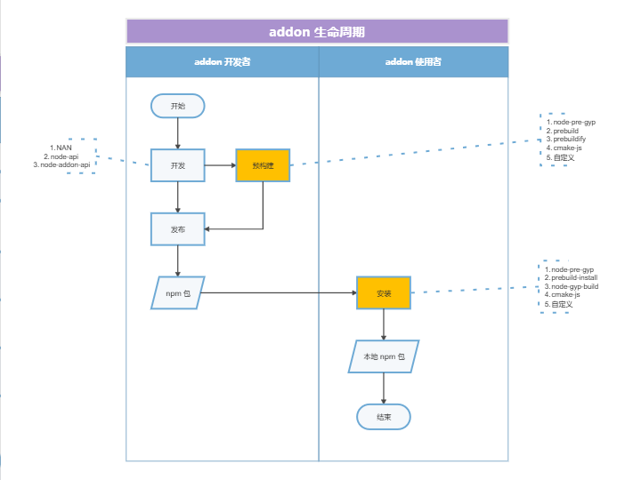
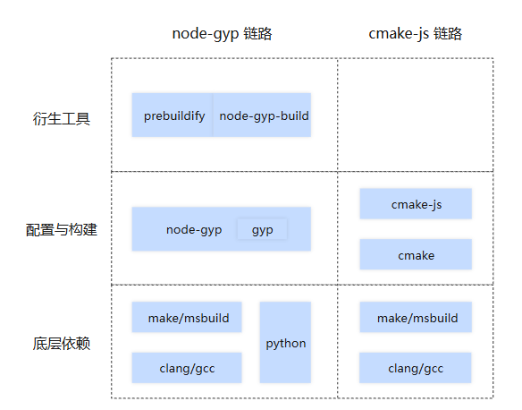
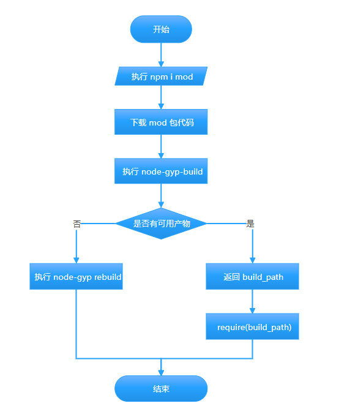
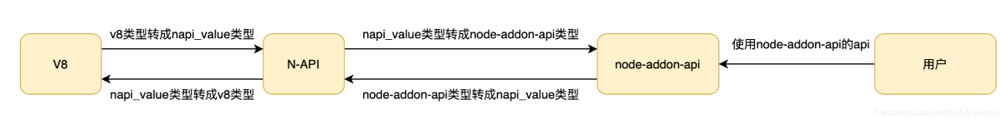
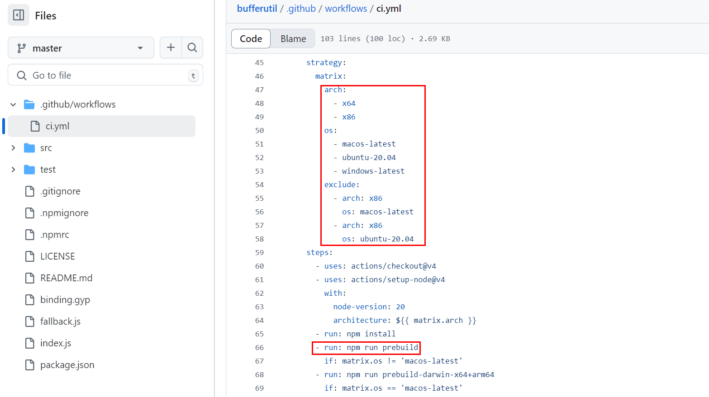
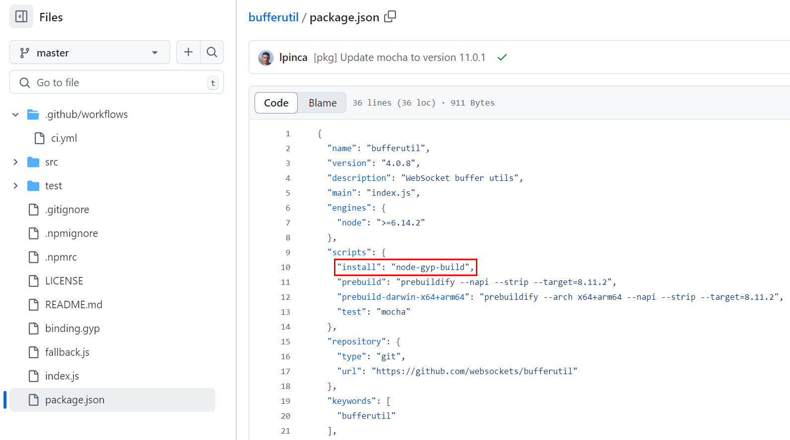
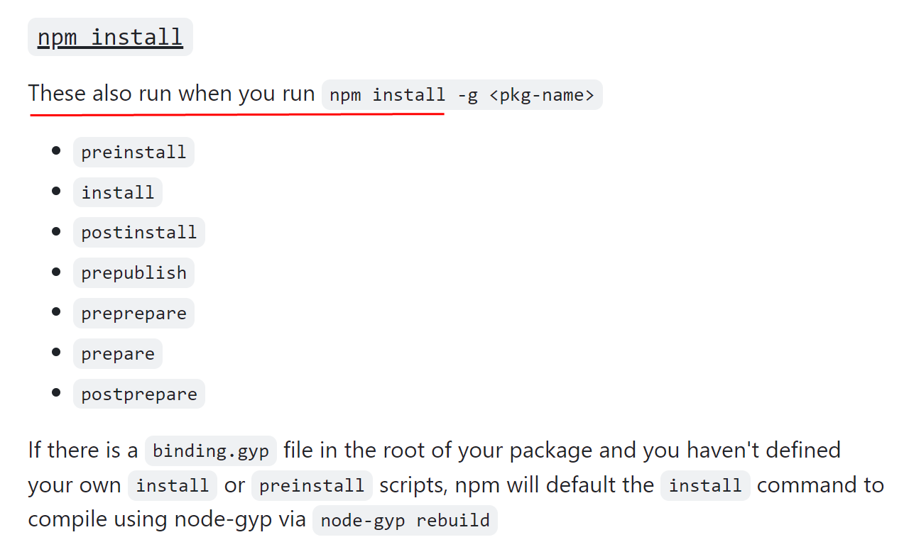

Node.js 是一个开源的、跨平台的 JavaScript 运行时环境，它允许开发者在服务器端运行 JavaScript 代码。Node.js 是基于 Chrome V8 引擎构建的，专为高性能、高并发的网络应用而设计，广泛应用于构建服务器端应用程序、网络应用、命令行工具等。

本系列将分为 9 篇文章为大家介绍 Node.js 技术原理：从调试能力分析到内置模块新增，从性能分析工具 perf_hooks 的用法到 Chrome DevTools 的性能问题剖析，再到 ABI 稳定的理解、基于 V8 封装 JavaScript 运行时、模块加载方式探究、内置模块外置以及 Node.js addon 的全面解读等主题，每一篇都干货满满。

在上一节中我们探讨了将 Node.js 内置模块外置的相关内容，在本节中则主要分享《Node.js addon 一文通》相关内容，本文内容为本系列第 9 篇，以下为正文内容。

## addon 是什么

addon 这个单词来源于英文的复合名词 add-on，add-on 来自短语 add on，意为附加物，可翻译为插件。

在 Node.js 领域，addon 是一种特殊模块，和普通的 JS 包的区别在于 addon 主要是用 C/C++ 写的，而普通模块是用 JS 写的。

例如我们使用的 npm 库 canvas、node-sass、sqlite3 等，这些就是 addon 模块，我们可以在它们的安装目录中看到里面有 .node 后缀名的文件。

## addon 适用场景

addon 的开发和使用，相对纯 JS 模块都比较复杂，一般只有特定场景会使用，包括：

1. 性能优化\
   众所周知，C++相对 JS 有绝对的性能优势。addon 技术使得 Node.js 拥有接近 C++的性能。如果你的 Node.js 工程有一小块业务属于 CPU 密集型计算，可以使用 addon 技术来优化性能。
2. 复用现有 C/C++ 库\
   Node.js 诞生至今已经有 15 年了，开发者通常会将其他成熟语言常用的库，用 JS 再实现一次。\
   但是有些 CPU 密集型计算的库，不适合用 JS 写，这时就会将原有的成熟的 C++库封装为 addon。例如 sharp、canvas 等。 当然，你也可以仅仅因为不想重复造轮子，而将一个 C++库封装为 addon。
3. 需要调用 Node.js 未封装的操作系统能力\
   如果你的 JS 程序需要调用一些操作系统上面的能力，而这些能力 Node.js 并没有帮你封装成标准库，这时候你就得自己写一个 addon，在 addon 里面用 C/C++ 代码去调相关的操作系统接口。

## addon 生命周期介绍

开发者完成 addon 开发后，可以将其发布到各种仓库，供后续自己或其他开发者使用。

不同于纯 JS 模块，addon 模块中有 C/C++代码，必须编译后才能使用。addon 开发者可以只发布 C/C++ 源码，让它在用户 npm install 装包的时候自动进行编译构建；也可以把编译产物也一起发布，让用户侧省去编译构建的步骤。

如下图所示，是 addon 生命周期。

其中，预构建是个可选环节，是否使用取决于 addon 开发者根据特定 addon 自身情况的选择。\
开发者可以选择提前编译构建出产物，以备后续随代码发布到 npm 仓库中。\
如果没有预构建，addon 会在安装时调用构建工具本地构建。\
所以安装没有预构建产物的 addon，需要环境中有必备的构建工具。

## addon 工具链介绍

### addon 工具链总览

上一节的 addon 业务流程图中，预构建和安装两个环节会用到一些工具，在右侧虚线半框中列出来了。\
这些工具，可以分到 node-gyp 和 cmake 两条工具链上。如下图：

其中 node-pre-gyp 已废弃，我们不再分析。

prebuild 和 prebuild-install 已经处于不提倡使用状态，以后将会逐渐淘汰，我们也不分析。

所以重点关注的工具还剩 5 个，包括 node-gyp、prebuildify、node-gyp-build、cmake、cmake-js。 这些工具还有 python、make/msbuild、clang/gcc 等底层依赖。

最后 addon 两条构建工具链路中，各个组件间关系概括为下图：

### node-gyp-build 工作原理

前文提到的两条工具链中，node-gyp 的市场占有率是 90%以上。而 node-gyp 的相关角色群体中，node-gyp-build 使用者群体是数量最大的，所以本节对 node-gyp-build 进行详细分析，其他则略过。

从前文的 addon 业务流程图可以看出，node-gyp-build 在安装环节起作用。node-gyp-build 就是这个环节的官方推荐工具。

具体业务流程如下图所示：

对上图做一下文字描述：\
假设我们要在一个 node 工程中，使用一个名称为 mod 的 addon 包。 首先，我们在 node 工程根目录运行`npm install mod`命令，装包。

接下来是装包详细过程：

1. 从 npm 仓库（也可能是其他仓库）下载 mod 包代码。

2. node-gyp-build 命令执行。

3. 执行过程中判断下载到的 mod 代码中，是否有可用的预构建产物。

   - 如果有，就会用 require 方法加载这个产物。加载成功后，整个装包流程结束。
   - 如果没有，就会执行`node-gyp rebuild`命令，进行本地构建。\
      本地构建成功的前提是，环境中有可用的 node-gyp、python、make/msbuild、clang/gcc 等底层依赖。 本地构建成功后，整个装包流程结束。

## addon 开发

### 选择实现方式

如何开发一个 addon 呢？\
随着 Node.js 演进，addon 有以下几种实现方式：

| 实现方式       | 基本描述                                             | Node.js 升级时改代码 | Node.js 升级时重新编译 |
| -------------- | ---------------------------------------------------- | -------------------- | ---------------------- |
| 直接写 C++     | 直接引用 v8、libuv 等库进行开发                      | 是                   | 是                     |
| NAN            | 使用 NAN (Native Abstraction for Node.js) 库进行开发 | 否                   | 是                     |
| Node-API       | 使用 Node-API 进行开发                               | 否                   | 否                     |
| node-addon-api | 使用 node-addon-api 进行开发                         | 否                   | 否                     |

当前，直接引用 v8 和使用 NAN 的实现方式已不推荐再用。

node-api 是集成在 Node.js 上的一些 api。它基本消除了 ABI 不稳定造成的影响。参考[理解 Node.js 中的 ABI 稳定](https://juejin.cn/post/7480539052426330139)。

node-addon-api 是一个基于 node-api 实现的 Node.js 三方库，这个库主要是通过封装，简化代码，提升开发体验。这是最常用，也是最推荐的 addon 实现方式。

### node-api 原理解析

由于 node-api 几乎是当前的唯一方案（node-addon-api 算是 node-api 的语法糖），所以我们需要重点学习。搞清楚 node-api 原理，就相当于掌握了 addon 开发。

简单来讲，node-api 实际是建立了与 v8 api 之间的映射，或者桥梁。如下图：

下面 是一个 node-addon-api 的例子的核心代码：

    #include <napi.h>

    Napi::String Method(const Napi::CallbackInfo& info) {
      Napi::Env env = info.Env();
      return Napi::String::New(env, "world");
    }

    Napi::Object Init(Napi::Env env, Napi::Object exports) {
      exports.Set(Napi::String::New(env, "hello"),
                  Napi::Function::New(env, Method));
      return exports;
    }

    NODE_API_MODULE(hello, Init)；

我们聚焦到`return Napi::String::New(env, "world")`，这行代码意思是，返回字符串"world"，相当于 js 的`return 'world'`。

`Napi::String::New`是 node-addon-api 的字符串类型表示。

运行时，`Napi::String::New`会被转成 napi_value 类型（node-api 中 string 类型的父类），然后再转成 V8 对应的类型。

### addon 开发教程

熟悉了前面介绍的 node-api 原理，想必你已经知道怎么开发 addon。

实际开发的部分细节可以参考这篇文档： <https://blog.csdn.net/qq1195566313/article/details/136725679>

## addon 预构建与发布

前文有提到过，预构建和包安装环节都可能对 addon 进行构建。\
推荐使用 prebuildify + node-gyp-build 方案进行构建，即预构建时使用 prebuildify，包安装使时用 node-gyp-build。\
预构建需要按操作系统和 cpu 架构，构建不同的产物。

下图是开源 npm 包  [bufferutil](https://github.com/websockets/bufferutil)  的 GitHub Actions 的 workflow 配置文件截图。

按照截图中的配置，在发布 bufferutil 新版本时，工作流将会创建 4（2×3-2）个虚拟机或容器，分别构建对应的操作系统和 cpu 架构组合的二进制产物。

另外，图中的`steps:run:npm run prebuild`步骤，会运行 bufferutil 根目录下的 package.json 中的定义的 prebuild 命令，如下图：

至此，阅读中的你应该了解到了 bufferutil 的正式预构建过程了。

## addon 的使用

本节我们来看看 addon 具体使用的相关细节。以推荐的 prebuildify + node-gyp-build 方案为例进行讲解。

### 本地构建和使用

所谓本地构建，通常用于开发场景的验证和调试。其本质和前文介绍的预构建并无区别，不过操作流程不一样。

当我们开发完一个 addon 时，按以下步骤进行本地构建和使用。

1.  安装 prebuildify\
    最好全局安装，命令如下：

        npm install prebuildify -g

2.  本地构建\
    这里仅给出最简参数配置，更多参数可以查阅 prebuildify 文档。

        prebuildify --napi

3.  导入并使用构建产物\
    导入代码示例：

        var addon = require('node-gyp-build')(__dirname);

        console.log(addon.hello()); // 'world'

    如上所示，`require('node-gyp-build')(__dirname)`会从当前目录查找 prebuilds、build 等目录，并从中找到 .node 文件进行加载（require('xxx.node')）。

### 正式使用一个 addon

在介绍 addon 正式使用之前，先得介绍一下 npm scripts 运行机制。

上一节的 package.json 截图中，我们可以看到其中还定义了`"install": "node-gyp-build"`，这一行代码是怎么运作的？它的运行原理涉及 npm scripts 的运行机制。

如下图所示，当 npm install 运行时，package.json 文件中的 scripts 中配置的部分命令也会执行。

按照 npm scripts 运行机制，npm install 运行时，node-gyp-build 也会运行。

而 node-gype-build 运行时，会先检测是否已经存在可用的构建产物；如果没有，会执行 node-gyp prebuild，本地构建一份。详见前文对 node-gyp-build 工作原理的介绍。

本文开头有说，addon 是特殊模块。特殊模块也是模块，其正式使用时的导入方式与普通模块相同，例如 require('bufferutil')。关于 addon 的加载的特殊性，在[Node.js 模块加载方式分析](https://juejin.cn/post/7493007413734424595)这篇文章有讲解。

小结一下，如何正式使用 addon：\
如果有当前环境可用预构建产物（需要预判或尝试），我们只需要将这个 addon 当做普通 npm 包使用即可；\
如果没有，那么 npm install 时，会进自动行本地构建。这就要求我们，提前准备好构建环境。以 Linux 环境为例，需要环境中有 node-gyp、python、gcc 或 clang 等合适的编译工具、make 等构建工具。

## 常见 addon 统计

为了让大家对 addon 生态有个完整的认识，这里列出一些 GitHub 上最常见的 addon，以供查阅。

| 名称           | 周下载量  | GitHub 收藏数 | 最近更新 日期 | 功能描述                                                   |
| -------------- | --------- | ------------- | ------------- | ---------------------------------------------------------- |
| sharp          | 7,113,354 | 28,300        | 2024-05-16    | 提供了用于高性能图像处理的功能                             |
| canvas         | 2,426,700 | 10,000        | 2023-04-03    | 提供了用于在 Node.js 中操作 HTML Canvas 的功能             |
| bcrypt         | 1,697,892 | 7,400         | 2023-08-04    | 用于密码哈希和加密的库                                     |
| sqlite3        | 898,561   | 6,100         | 2024-01-05    | 提供了对 SQLite 数据库的异步访问和操作                     |
| better-sqlite3 | 753,025   | 5,200         | 2024-06-01    | 提供了更好的 SQLite3 Node.js 绑定，使用了预编译的 SQL 语句 |
| re2            | 660,851   | 505           | 2024-05-23    | 正则表达式引擎                                             |
| oracledb       | 227,586   | 2,200         | 2024-05-23    | Oracle 数据库绑定                                          |
| heapdump       | 63,072    | 2,500         | 2019-07-28    | 堆转储工具                                                 |
| nodegit        | 59,676    | 5,600         | 2020-07-29    | 提供了 node 操作 Git 的能力                                |

## 统计日期：2024 年 7 月

本文是本系列的最后一个章节，恭喜大家完成本系列学习内容，希望你能从本系列中学习到以下技能：

- 提升调试与性能优化能力
- 深入理解模块化与扩展机制
- 探索底层技术与定制化能力

同时欢迎大家一起参与 OpenTiny 开源共建：[朋友你好，一起加入 OpenTiny 社区吧\~](https://juejin.cn/post/7485276868524097573)

## 关于 OpenTiny

欢迎加入 OpenTiny 开源社区。添加微信小助手：opentiny-official 一起参与交流前端技术～\
OpenTiny 官网：**<https://opentiny.design>**\
OpenTiny 代码仓库：**<https://github.com/opentiny>**\
TinyVue 源码：**<https://github.com/opentiny/tiny-vue>**\
TinyEngine 源码：**<https://github.com/opentiny/tiny-engine>**\
欢迎进入代码仓库 Star🌟TinyEngine、TinyVue、TinyNG、TinyCLI、TinyEditor\~ 如果你也想要共建，可以进入代码仓库，找到 good first issue 标签，一起参与开源贡献\~
