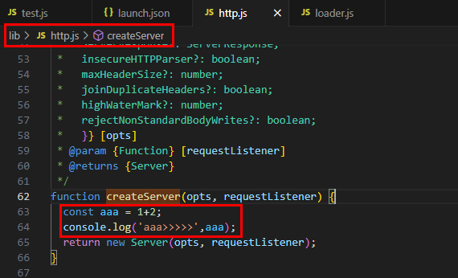
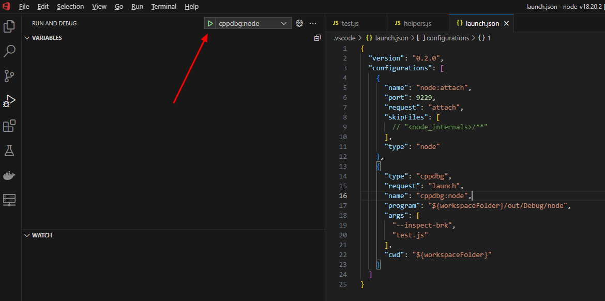
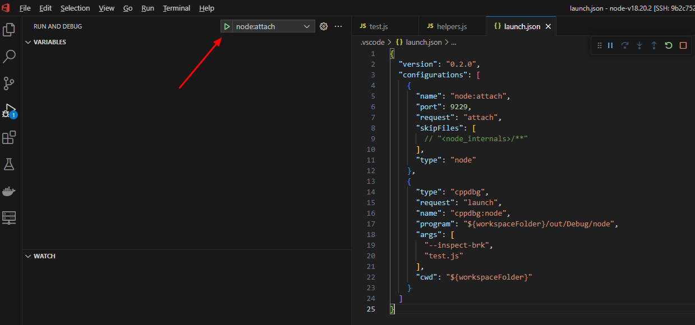
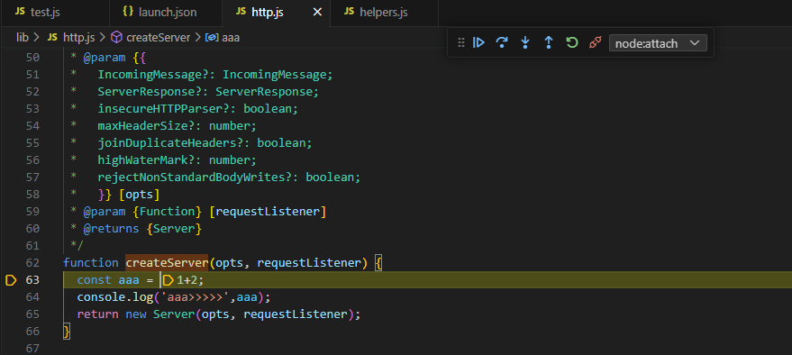

Node.js 是一个开源的、跨平台的 JavaScript 运行时环境，它允许开发者在服务器端运行 JavaScript 代码。Node.js 是基于 Chrome V8 引擎构建的，专为高性能、高并发的网络应用而设计，广泛应用于构建服务器端应用程序、网络应用、命令行工具等。

本系列将分为 9 篇文章为大家介绍 Node.js 技术原理：从[调试能力分析](https://mp.weixin.qq.com/s?__biz=MzU5ODA3OTY5Ng==&mid=2247498508&idx=1&sn=7e992f51177bba4c75ab4806bc882ccc&scene=21#wechat_redirect)到[内置模块新增](https://mp.weixin.qq.com/s?__biz=MzU5ODA3OTY5Ng==&mid=2247498516&idx=1&sn=0be4fd5bf9277d603d4b726ae648eefe&scene=21#wechat_redirect)，从[性能分析工具 perf_hooks 的用法](https://mp.weixin.qq.com/s?__biz=MzU5ODA3OTY5Ng==&mid=2247498602&idx=1&sn=700b62e90ab488ee3f87cbce6ddd304b&scene=21#wechat_redirect)到  [Chrome DevTools 的性能问题剖析](https://mp.weixin.qq.com/s?__biz=MzU5ODA3OTY5Ng==&mid=2247498602&idx=1&sn=700b62e90ab488ee3f87cbce6ddd304b&scene=21#wechat_redirect)，再到  [ABI 稳定的理解](https://mp.weixin.qq.com/s?__biz=MzU5ODA3OTY5Ng==&mid=2247498628&idx=1&sn=79c50ee08761a8c5791ba7dbe3376a42&scene=21#wechat_redirect)、[基于 V8 封装 JavaScript 运行时](https://mp.weixin.qq.com/s?__biz=MzU5ODA3OTY5Ng==&mid=2247498689&idx=1&sn=ca4de53b7b3a590522716ddee4a77e95&scene=21#wechat_redirect)、[模块加载方式探究](https://mp.weixin.qq.com/s?__biz=MzU5ODA3OTY5Ng==&mid=2247498775&idx=1&sn=551f63a4a202b6d749d3d6595fb67035&scene=21#wechat_redirect)、内置模块外置以及 Node.js addon 的全面解读等主题，每一篇都干货满满。

在上一节中我们探讨了 Node.js 模块加载方式分析的相关内容，在本节中则主要分享《Node.js 内置模块外置》相关内容，本文内容为本系列第 8 篇，由体验技术团队屈金雄原创，以下为正文内容。

## 前言

本人最近的工作涉及 Node.js 的定制开发，直白点说就是，需要修改 Node.js 源码。

一般来说，Node.js 源码修改后，需要重新构建才能生效。如果频繁修改，频繁构建，就很费时间。

这时，我们可以用内置模块外置这种办法，避免重新构建。

## 什么叫内置模块外置？

我们知道 node 源码主要是由 C++ 和 js 两部分组成。其中 js 代码都在 lib 目录下。

普通方式构建的 node，lib 代码是打包到构建产物中的。node 工程运行时，所用的 js 源码也取自构建产物。如果修改了 lib 代码，只有重新构建才能生效。

为了方便开发和调试，我们在进行 node 构建配置的时候可使用 --node-builtin-modules-path 参数。

```js
./configure --node-builtin-modules-path "$(pwd)"
```

有了这个参数，构建产物不会包含 lib 代码。node 工程运行需要导入 lib 中的 js 模块时，会从构建时指定的目录查找，在示例中就是运行./configure 命令的目录（pwd）。

这样我们就将 lib 下的 js 代码外置了。

内置模块是 node 的一部分，有些是纯 js 的，有些外层是 js，底层是 C++。其 js 代码自然也都在 lib 目录下。所以本节讲的 lib 代码外置，同样适用于内置模块的 js 代码。

当我们将内置模块的 js 代码外置时，就是将**内置模块外置**。

## 构建 lib 外置的 node

关于 node 构建，请参考官方文档的 BUILDING.md 文件，这里只是简单列出主要步骤。

以 Ubuntu 操作系统为例，简明构建过程如下：

```js
// 1.环境准备
apt install python3 g++ make python3-pip

// 2.清除旧版配置（源码准备步骤已省略）
make clean

// 3.配置
./configure --node-builtin-modules-path "$(pwd)"

// 4.构建
make -j32
```

## 验证外置 lib 是否生效

按步骤进行如下操作：

1. 准备一个待运行的 node 工程\
   创建一个单文件 node 工程，命名为 test.js，代码如下。\
   为方便起见，将 test.js 直接放在 node 源码的根目录下。

```js
// test.js

const { createServer } = require('node:http')

const hostname = '127.0.0.1'
const port = 3000

const server = createServer((req, res) => {
  res.statusCode = 200
  res.setHeader('Content-Type', 'text/plain')
  res.end('Hello World')
})

server.listen(port, hostname, async () => {
  console.log(`Server running at http://${hostname}:${port}/`)
})
```

2. 更改 http 模块的 createServer 方法的 js 源码，如下图
   

3. 运行\
    

   如图所示，先用了安装在环境中的普通版本 node，运行 test.js，没有额外的打印信息；然后用外置标准库版本的 node 运行 test.js，打印出了预期的信息，而我们上一步改过代码后，并未重新构建 node。说明此时 node 运行，使用的 lib 代码确实是外置的。

## 验证外置标准库是否可调试

我们首先验证的是 vscode launch 模式，有未解决报错。 之后又尝试，vscode attach 模式，结果成功了，现将流程分享给大家。如果对调试细节有疑问，请阅读 Node.js 调试能力分析。1. 按《Node.js 调试能力分析》这一节中第 1 步操作 2. 配置 vscode launch.json 文件\
注意，要将 program 指向我们先前编译好的外置标准库版的 node。vscode 2020 年 11 月之后的版本支持了这种外置标准库的断点调试。接下来我们验证一下，调试是否能走通。按如下步骤操作：

```js
{
  "version":"0.2.0",
"configurations":[
    {
      "name":"node:attach",
      "port":9229,
      "request":"attach",
      "skipFiles":[
        // "<node_internals>/**"
      ],
      "type":"node"
    },
    {
      "type":"cppdbg",
      "request":"launch",
      "name":"cppdbg:node",
      "program":"${workspaceFolder}/out/Debug/node",
      "args":[
        "--inspect-brk",
        "test.js"
      ],
      "cwd":"${workspaceFolder}"
    }
]
}
```

3. 修改一段 lib 代码\
   这里我们继续使用之前的 createServer 中的修改。

4. 启动 test.js\
   选择 cppdbg:node 后，点击绿色三角，启动 test.js。\
   注意我们 launch.json 中配置了`--inspect-brk`参数，这个参数会让我们的调试器在业务代码第一行停住。
   

5. 连接调试服务器\
   选择 node:attach 后，点击绿色三角，启动 test.js。
   

6. 结果展示\
   上一步操作完成后，调试器停在第一行代码处，这时点击下一步来到 createServer 处，然后点击下钻（step into），即可来到我们先前修改的 createServer 代码处，如下图所示。至此，我们验证通过了外置 lib 的调试。
   

---

下一节，将分享《Node.js addon》相关内容，请大家持续关注本系列内容\~学习完本系列，你将获得：

- 提升调试与性能优化能力
- 深入理解模块化与扩展机制
- 探索底层技术与定制化能力

同时欢迎大家一起参与 OpenTiny 开源共建：[朋友你好，一起加入 OpenTiny 社区吧\~](https://mp.weixin.qq.com/s?__biz=MzU5ODA3OTY5Ng==&mid=2247498700&idx=1&sn=4d8ab269d1c9c7be47e5f5baf726b229&scene=21&token=109915013&lang=zh_CN#wechat_redirect)

## 关于 OpenTiny

欢迎加入 OpenTiny 开源社区。添加微信小助手：opentiny-official 一起参与交流前端技术～\
OpenTiny 官网：**<https://opentiny.design>**\
OpenTiny 代码仓库：**<https://github.com/opentiny>**\
TinyVue 源码：**<https://github.com/opentiny/tiny-vue>**\
TinyEngine 源码：**<https://github.com/opentiny/tiny-engine>**\
欢迎进入代码仓库 Star🌟TinyEngine、TinyVue、TinyNG、TinyCLI、TinyEditor\~ 如果你也想要共建，可以进入代码仓库，找到 good first issue 标签，一起参与开源贡献\~
