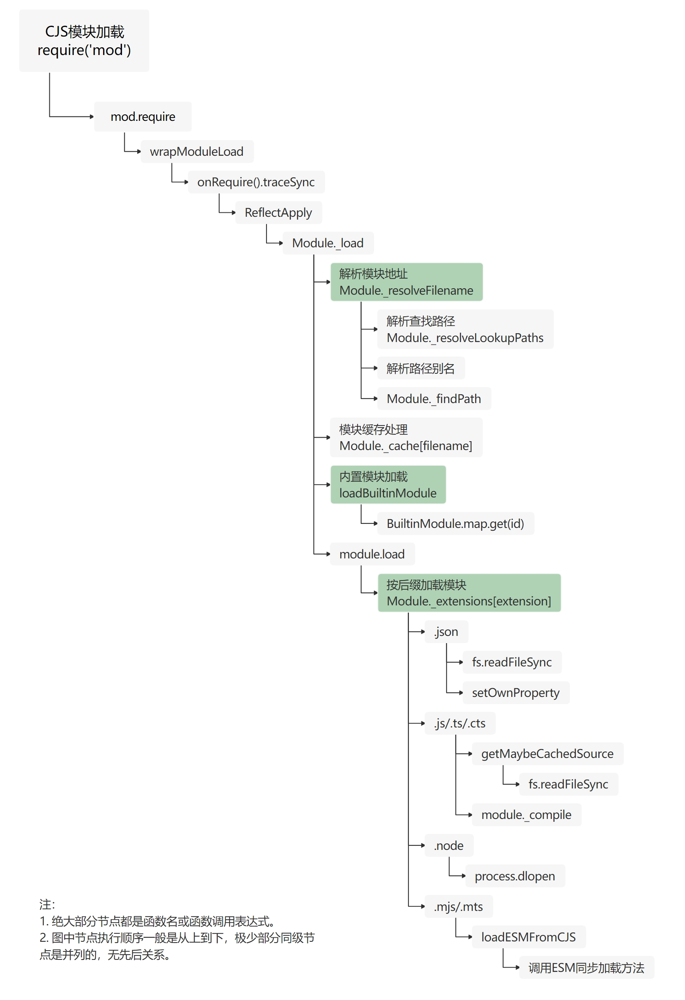
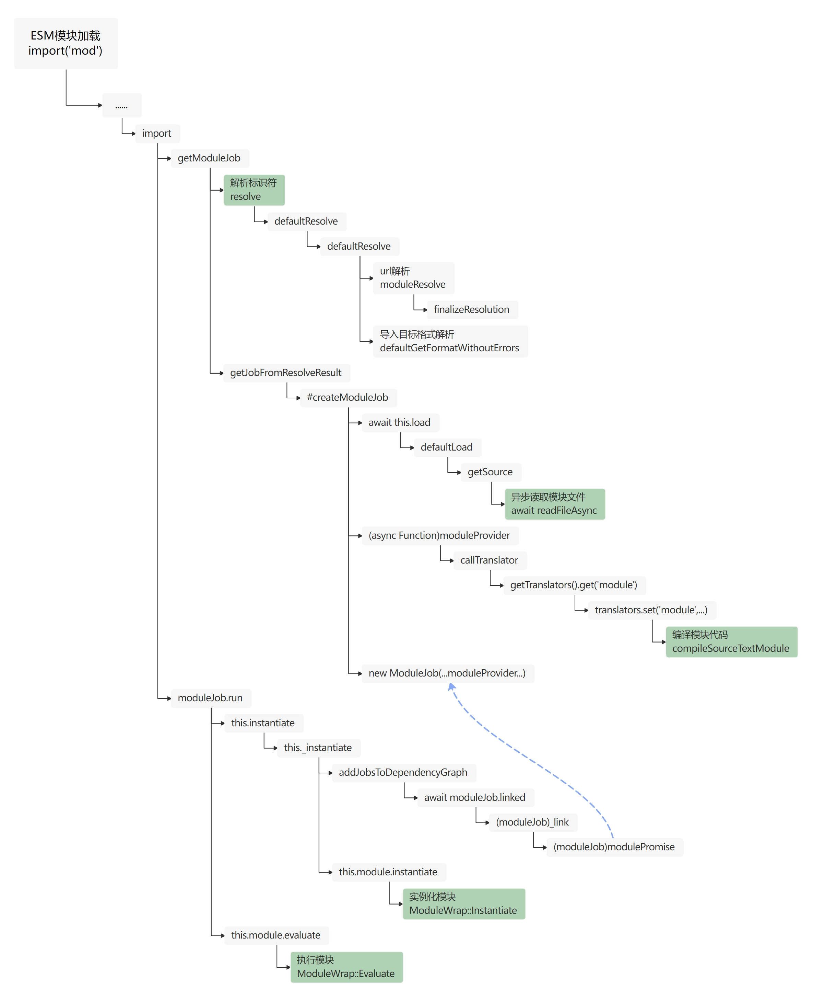
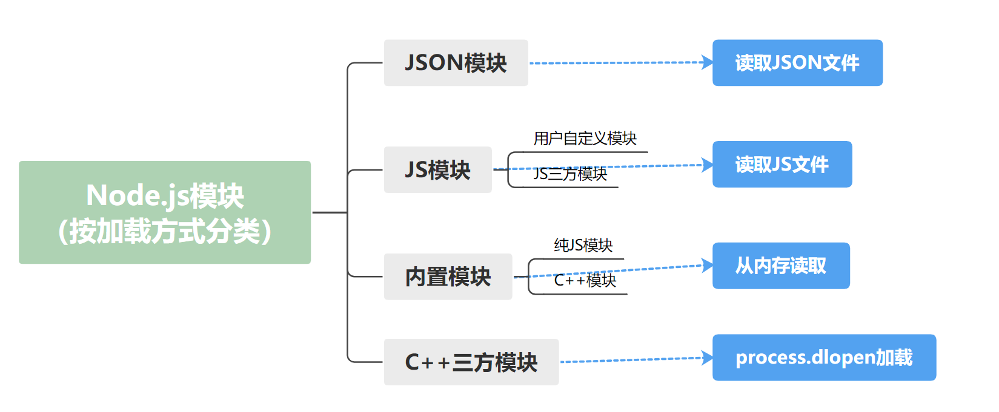
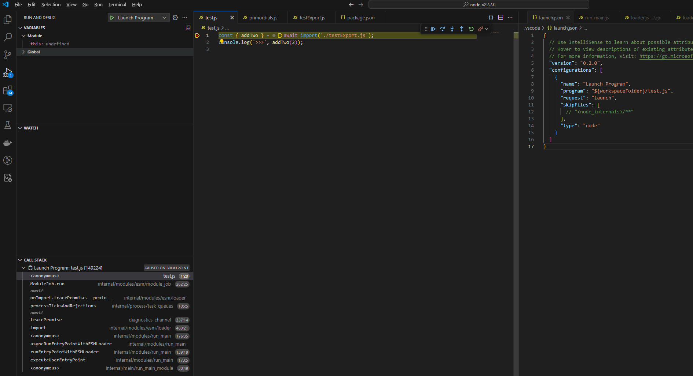
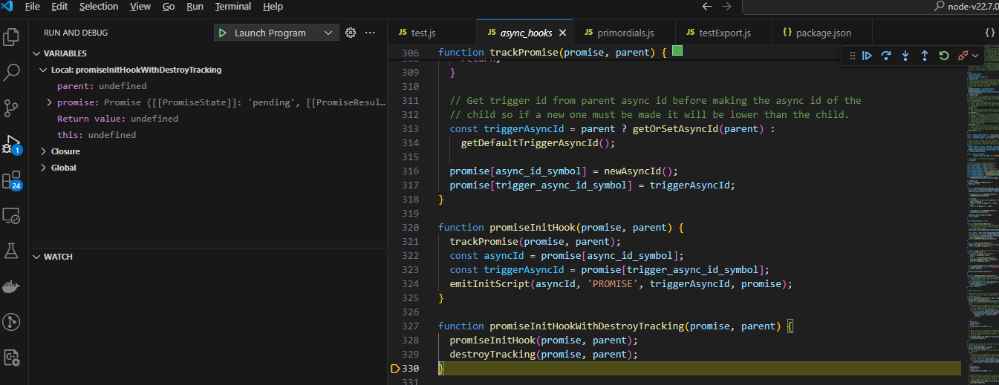
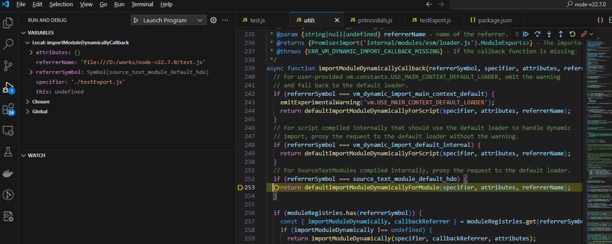
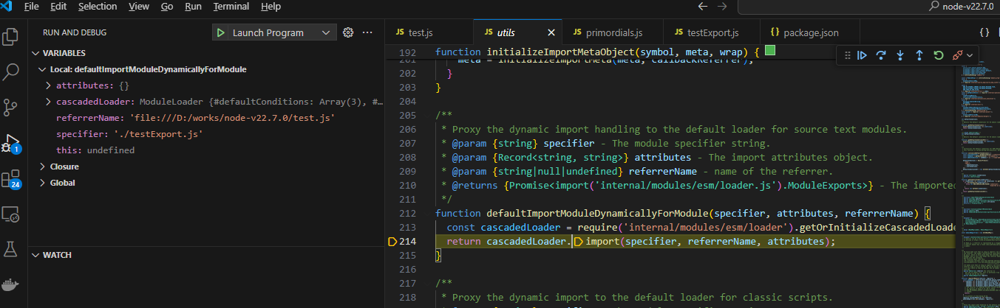
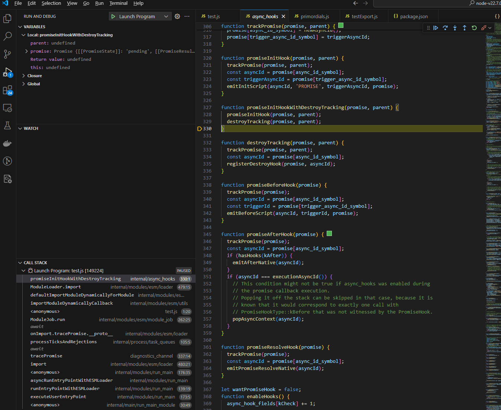
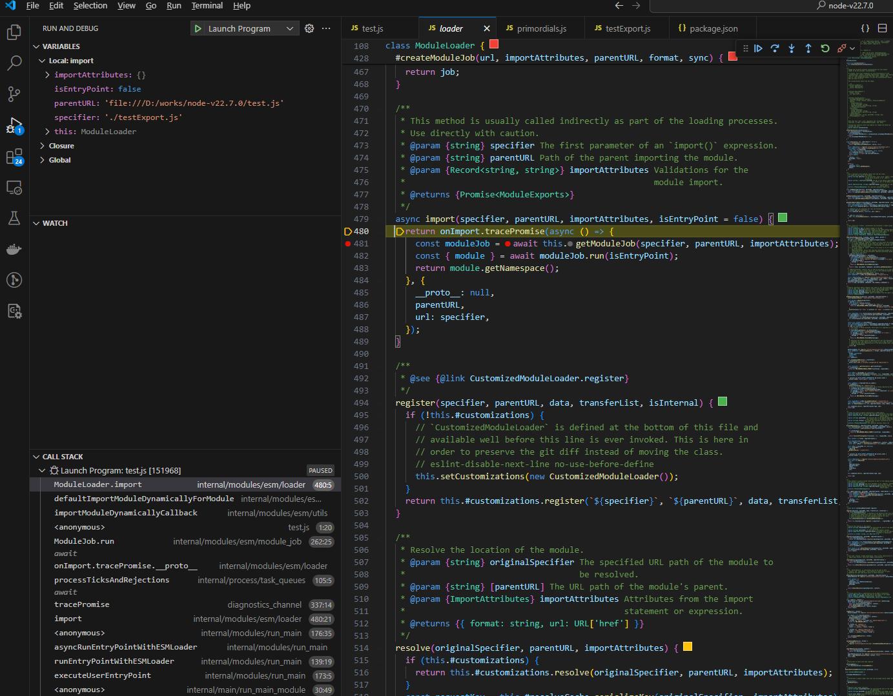

Node.js 是一个开源的、跨平台的 JavaScript 运行时环境，它允许开发者在服务器端运行 JavaScript 代码。Node.js 是基于 Chrome V8 引擎构建的，专为高性能、高并发的网络应用而设计，广泛应用于构建服务器端应用程序、网络应用、命令行工具等。

本系列将分为 9 篇文章为大家介绍 Node.js 技术原理：从[调试能力分析](https://mp.weixin.qq.com/s?__biz=MzU5ODA3OTY5Ng==&mid=2247498508&idx=1&sn=7e992f51177bba4c75ab4806bc882ccc&scene=21#wechat_redirect)到[内置模块新增](https://mp.weixin.qq.com/s?__biz=MzU5ODA3OTY5Ng==&mid=2247498516&idx=1&sn=0be4fd5bf9277d603d4b726ae648eefe&scene=21#wechat_redirect)，从[性能分析工具 perf_hooks 的用法](https://mp.weixin.qq.com/s?__biz=MzU5ODA3OTY5Ng==&mid=2247498541&idx=1&sn=5d58e7b1520ba92793fcd6519bf2f108&scene=21#wechat_redirect)到  [Chrome DevTools 的性能问题剖析](https://mp.weixin.qq.com/s?__biz=MzU5ODA3OTY5Ng==&mid=2247498602&idx=1&sn=700b62e90ab488ee3f87cbce6ddd304b&scene=21#wechat_redirect)，再到  [ABI 稳定的理解](https://mp.weixin.qq.com/s?__biz=MzU5ODA3OTY5Ng==&mid=2247498628&idx=1&sn=79c50ee08761a8c5791ba7dbe3376a42&scene=21#wechat_redirect)、[基于 V8 封装 JavaScript 运行时](https://mp.weixin.qq.com/s?__biz=MzU5ODA3OTY5Ng==&mid=2247498689&idx=1&sn=ca4de53b7b3a590522716ddee4a77e95&scene=21#wechat_redirect)、模块加载方式探究、内置模块外置以及 Node.js addon 的全面解读等主题，每一篇都干货满满。

在上一节中我们探讨了[基于 V8 封装 JavaScript 运行时](https://mp.weixin.qq.com/s?__biz=MzU5ODA3OTY5Ng==&mid=2247498689&idx=1&sn=ca4de53b7b3a590522716ddee4a77e95&scene=21#wechat_redirect)的相关内容，在本节中则主要分享《Node.js 模块加载方式分析》相关内容，本文内容为本系列第 7 篇，以下为正文内容。

## 1 前言

如今，Node.js 同时实现了 CJS（CommonJS）和 ESM（ECMAScript Module）两套规范，来进行模块管理。

由于早期 JS 没有自己的官方模块规范，在很长一段时间以来 Node.js 一直使用非官方的 CJS 规范。直到 2015 年 ES6 发布，里面定义了 ESM 的规范，各种构建工具和浏览器才逐渐兼容它，而 Node.js 更是在 2019 年的 node 13.2.0 版本才开始正式支持 ESM 特性。

本文以 Node.js 22.7.0 源码为基础，分析 node 对这两个模块规范的具体实现（源码分析方法在最后一节有介绍）。

当我们执行 require/import 的时候，在 node 内部，会发生什么？

## 2 模块和包的定义

下文中常提到两个概念：模块和包，在文章开始前我们先对它们做一个定义上的澄清。

- 模块\
   模块是 Node.js 工程的组成部分。模块可以是一个 json 文件，也可以是一个定义了导出值（对象、方法、常量）的文件，也可以是一个三方包。
- 包\
   包是一个由 package.json 文件描述的文件夹。需注意包也是模块。

## 3 分析 CJS 模块加载方式

分析时需注意盯紧分析的主要目标，不要迷失在复杂的非关键逻辑和细节中。

下图是 CJS 模块加载的主要函数调用过程：



如图所示，用绿色标出来的节点是核心过程。

核心代码入口在`Module._load`节点，所在文件是 lib/internal/modules/cjs/loader.js。

CJS 模块加载过程可以分为两大步骤：

1. 解析模块地址
2. 正式加载模块\
   也就是根据解析到的地址，读取模块内容，编译后挂载到  `module.exports`  对象上。

正式加载模块时，会先判断缓存中是否已有，再判断是否是内置模块（内置模块是特殊的处理流程），然后根据模块源码文件的后缀名，进行不同后续逻辑。

接下来分别介绍这几个核心过程。

### 3.1 解析模块地址

也就是`Module._resolveFilename`节点。\
这个节点往后都是通过 require 函数入参解析出模块地址的逻辑。例如`const test = require('./test')`，通过解析得到的地址会是形如`D:\works\node-v22.7.0\test.js`，这样的文件路径。

源码中用的 filename，直译过来是文件名。但是这里用“模块地址”表达比较好，filename 这个名称不太优雅。

### 3.2 内置模块加载

也就是`loadBuiltinModule`节点。\
这个节点处理的是内置模块加载业务。

如下代码所示，`BuiltinModule.map.get(id)`这一行，是关键代码。

```js
function loadBuiltinModule(id, request) {
  if (!BuiltinModule.canBeRequiredByUsers(id)) {
    return
  }
  /** @type {import('internal/bootstrap/realm.js').BuiltinModule} */
  const mod = BuiltinModule.map.get(id)
  debug('load built-in module %s', request)
  // compileForPublicLoader() throws if canBeRequiredByUsers is false:
  mod.compileForPublicLoader()
  return mod
}
```

`BuiltinModule.map`是一个静态变量，意味着程序代码解释阶段，就会写入内存中。它是一个 Map 类型的 对象，以模块名称为 key，存放各种类型的模块的内容。内容包括模块名称、编译后的模块源码等。 这段模块加载的代码只展示了如何从内存取用模块。那么内存中的模块又是什么怎么写入的呢？

内置模块的加载分为两个步骤。

1. 注册\
   是在 node 工程启动时完成的，注册是指将模块源码之外的信息写入内存中的`BuiltinModule.map`。
2. 加载，即编译模块源码并写入内存。\
   是指编译模块源码并将已编译源码写入`BuiltinModule.map`。

所有模块只有使用（require 或 internalBinding）时才会彻底完成加载。\
一个模块加载完成的标志是，内存中有该模块编译好的代码。

### 3.3 按后缀加载模块

也就是`Module._extensions[extension]`节点。\
这个节点，按前面解析出的文件后缀名，选用不同的加载逻辑，对模块进行加载。 需要注意的是，除了内置模块，其他所有模块都会在解析模块地址（前文有提到）时，被解析为一个带后缀文件。

如 CJS 模块加载图所示，可分为四类。

- **.json**\
   先同步读取 json 文件内容，然后包装成模块，再挂载到`module.exports`上
- **.js/.ts/.cts**\
   先同步读取 js 文件内容，然后编译，再挂载到`module.exports`上
- **.node**\
   .node 后缀说明该文件是 addon 的构建产物。.node 文件本质是在 npm install 安装模块时，编译出的动态链接（c++概念）。其加载逻辑是用`process.dlopen`方法完成。
- **.mjs/.mts**\
   这个分支，用来做 CJS 方式加载.mjs/.mts 文件。

## 4 分析 ESM 模块加载方式

本文对 ESM 模块加载方式的分析，也是源于源码。源码阅读与调试方式，在最后一节介绍。这里直接用下面的思维导图来记录 ESM 模块加载过程。



如图所示，用绿色标出来的节点是核心过程。

核心代码入口在`import`节点，也就是 import 方法，所在文件是 lib/internal/modules/esm/loader.js。

从上到下，导入一个 es module 过程中，依次经历了解析标识符、异步（除非专门设置，默认都是异步）读取模块文件、编译模块代码、实例化模块、执行模块等过程。

接下来依次逐个分析这几个过程。

### 4.1 标识符解析

#### 4.1.1 什么是标识符？

标识符（specifier）是指使用 import 语句中 from 关键字后面的字符串，或 import() 的入参，或 export 语句中 from 关键字后面的字符串。

例如下面三种示例中的字符串 module-name，都是标识符。

```ts
// 示例 1：
import { export1 } from 'module-name'

// 示例 2：
import('module-name')

// 示例 3：
export * from 'module-name'
```

在 Node.js 中，node 会根据标识符解析出 url 和 format，两个关键数据。前者是个 URL 类型的对象，后者是字符串。用于后续的模块文件读取和模块代码编译。

#### 4.1.2 url 解析

url 解析是指将标识符解析为 url 的过程。

这里需要回顾一下 url 的定义：URL 的全名是统一资源定位符，它包含  `http://`、`https://`、`ftp://`、`file://`、 `data:text/plain`、`mailto:user@example.com`  等多种形式。

url 解析会将相对/绝对路径、三方包等各种形式的标识符解析为  `file://`  的形式（`file://`  是引用本地文件的标准方式）。

特别说明一下，严格来说，url 和标识符是两个概念，有不同的边界。但是源码中会将由标识符解析出的 url 继续称作标识符，有些文档也有混用的情况。我觉得是可以接受的。 因为只要 node 支持的 url，都可以直接作为标识符，例如：`file:///home/myProject/test.js`。只是通常我们不会这么写。

常见的标识符有三种：

> - Relative specifiers like './startup.js' or '../config.mjs'. They refer to a path relative to the location of the importing file. The file extension is always necessary for these.
> - Bare specifiers like 'some-package' or 'some-package/shuffle'. They can refer to the main entry point of a package by the package name, or a specific feature module within a package prefixed by the package name as per the examples respectively. Including the file extension is only necessary for packages without an "exports" field.
> - Absolute specifiers like 'file:///opt/nodejs/config.js'. They refer directly and explicitly to a full path.

实际还可以支持更多形式的标识符，例如：

- '#alias'\
   这是路径别名。

  如果你想根据环境切换实际依赖，可以通过 package.json 的 imports 字段配置别名来实现。

  例如，你可能需要创建一个同时兼容 Node.js 和浏览器的三方包。三方包的 package.json 中部分代码需要配置如下：

  ```js
  // package.json
  {
   "imports": {
     "#dep": {
       "node": "dep-node-native",
       "default": "./dep-polyfill.js"
     }
   },
   "dependencies": {
     "dep-node-native": "^1.0.0"
   }
  }

  // index.js
  import dep from '#dep'

  // ...
  ```

  那么，当这个三方包在 node 工程中使用时，三方包中的`import dep from '#dep'`语句实际会加载  `dep-node-native`；当这个三方包在前端工程中使用时，三方包中的`import dep from '#dep'`语句实际会加载`./dep-polyfill.js`.

- 下列源码中，`extensionFormatMap`中的各种扩展名

  ```js
  const experimentalWasmModules = getOptionValue('--experimental-wasm-modules')

  const extensionFormatMap = {
    __proto__: null,
    '.cjs': 'commonjs',
    '.js': 'module',
    '.json': 'json',
    '.mjs': 'module'
  }

  if (experimentalWasmModules) {
    extensionFormatMap['.wasm'] = 'wasm'
  }

  if (getOptionValue('--experimental-strip-types')) {
    extensionFormatMap['.ts'] = 'module-typescript'
    extensionFormatMap['.mts'] = 'module-typescript'
    extensionFormatMap['.cts'] = 'commonjs-typescript'
  }
  ```

- import(./\${moduleName}.js)\
   动态计算模块路径

分析过程中，我有过两个小疑问，也呈现一下，供参考：

1. 为什么要解析成 URL 类型？

   ESM 规范没有这方面的规定。\
   经源码分析，除了内置模块，各种形式的标识符都可以解析为 URL 形式。\
   所以可能是出于统一数据结构的需要。

2. 模块文件查找顺序是怎样的？

   了解模块加载时的文件查找顺序，有助于我们处理各种 xxx 找不到问题。\
   但是太过复杂，这里不记录了。如果有必要再根据问题的情况，调试源码比较明智。 只要有调试方法（在后面的章节会给出）和模块加载的思维导图，很容易就能定位处理单个 case。

   核心代码在 lib/internal/modules/esm/resolve.js 文件的 moduleResolve 方法中。

#### 4.1.3 格式解析

node 中，ESM 源码实现中有一个清晰的 translator 层（lib/internal/modules/esm/translators.js）。通过这个层，可以根据标识符解析出的 format，切换 translator，从而对不同类型的模块做不同的处理。

当前的 node 版本中，有 10 种 translator，分别对应 10 种 format。

translator 是什么？有什么作用？接下来按不同 format，逐个分析一下。

- module 格式\
   表示当前导入模块是 esm。

  ```js
  translators.set('module', function moduleStrategy(url, source, isMain) {
    assertBufferSource(source, true, 'load')
    source = stringify(source)
    debug(`Translating StandardModule ${url}`)
    const { compileSourceTextModule } = require('internal/modules/esm/utils')
    const module = compileSourceTextModule(url, source, this)
    return module
  })

  // ...

  function compileSourceTextModule(url, source, cascadedLoader) {
    const hostDefinedOption = cascadedLoader ? source_text_module_default_hdo : undefined
    const wrap = new ModuleWrap(url, undefined, source, 0, 0, hostDefinedOption)

    if (!cascadedLoader) {
      return wrap
    }
    // Cache the source map for the module if present.
    if (wrap.sourceMapURL) {
      maybeCacheSourceMap(url, source, wrap, false, undefined, wrap.sourceMapURL)
    }
    return wrap
  }
  ```

  这段代码就是一个 translator。

  其中的入参 source 是前置步骤——异步读取模块文件得到的模块代码。\
   第 5 行中使用了 require，说明当前版本的 esm 还在依赖 cjs 实现。\
   第 6 行 new ModuleWrap 中包含了模块源代码编译过程。

- builtin 格式\
   表示当前导入的模块是内置模块。

  ```js
  translators.set('builtin', function builtinStrategy(url) {
    debug(`Translating BuiltinModule ${url}`)
    // Slice 'node:' scheme
    const id = StringPrototypeSlice(url, 5)
    const module = loadBuiltinModule(id, url)
    cjsCache.set(url, module)
    if (!StringPrototypeStartsWith(url, 'node:') || !module) {
      throw new ERR_UNKNOWN_BUILTIN_MODULE(url)
    }
    debug(`Loading BuiltinModule ${url}`)
    return module.getESMFacade()
  })
  ```

  第 5 行，通过内置模块 id，直接从内存获取内置模块。与 cjs 实现相同，具体参考本文第四节 CJS 模块加载分析。

- json 格式\
   表示当前导入的模块是 json 文件。 esm 实现对 json 文件的处理方式与 cjs 实现类似。都是读取解析 json 文件后，将其封装为一个模块。

  ```js
  translators.set('json', function jsonStrategy(url, source) {
    // ...

    try {
      const exports = JSONParse(stripBOM(source))
      module = {
        exports,
        loaded: true
      }
    } catch (err) {
      // TODO (BridgeAR): We could add a NodeCore error that wraps the JSON
      // parse error instead of just manipulating the original error message.
      // That would allow to add further properties and maybe additional
      // debugging information.
      err.message = errPath(url) + ': ' + err.message
      throw err
    }
    if (shouldCheckAndPopulateCJSModuleCache) {
      CJSModule._cache[modulePath] = module
    }
    cjsCache.set(url, module)
    return new ModuleWrap(url, undefined, ['default'], function () {
      debug(`Parsing JSONModule ${url}`)
      this.setExport('default', module.exports)
    })
  })
  ```

- 其他\
   前三种已经包括了 esm 实现的绝大部分使用需要，其他几个不常用，有需要可以到 lib/internal/modules/esm/translators.js，直接看源码。

### 4.2 异步读取模块文件

除了内置模块，每个模块的加载都会有文件读取环节。

衔接上一节，上一节解析得到了模块 url（文件地址），本节是用解析到的 url 来找到模块文件并读取。

不同于 cjs，除非特别设置，esm 模块加载，无论是静态导入，还是动态导入，都是异步读取模块文件。

### 4.3 编译模块代码

在编译阶段，会根据步骤 4.1 得到的模块 format，选用对应的 translator，对步骤 4.2 读取到的模块文件进行编译。

阅读源码时需要注意，esm 模块的源码使用了 Promise 高级用法：(moduleJob)modulePromise 节点使用的 moduleProvider，本质是个 async Function，也就是异步任务。这个异步任务在(async Function)moduleProvider 节点处创建，但是在 await moduleJob.linked 节点处才加入任务队列（执行）。

### 4.4 实例化模块

上一步得到的编译产物会存储到模块包装类 ModuleWrap 的实例中。

这一步在 ModuleWrap 的实例的基础上，完成模块的实例化。

### 4.5 执行模块

ESM 模块加载完成后，都会立即执行一次。

为什么会立即执行一次呢？看起来这个步骤没有必要，反而空耗性能。

大模型给的回答如下：

1. 模块可能包含全局或静态代码，需要初始化
2. 有些模块需要向全局作用域注入变量、打补丁等

## 5 按加载方式分类 Node 模块

经分析，按加载方式分类 Node.js 模块，可以帮助我们更好地记忆、更清晰地理解 node 模块加载过程以及运行原理知识。



如图所示，前三个分类同时适用于 CJS 和 ESM 实现；C++三方模块，也就是 addon，目前只有 CJS 实现了这类模块的加载，ESM 暂不支持加载 addon。

## 6 CJS 与 ESM 的关联

首先声明，这里讨论的“关联”，仅限于 Node.js 实现的 CJS 和 ESM。

### 6.1 ESM 对 CJS 有依赖

CJS 和 ESM 在 node 中都是用 JS 语言实现的。

ESM 源码文件（例如 lib/internal/modules/esm/loader.js）本身也是一个 node 模块，其加载是通过 CJS 实现来完成的。

例如前文提到的`defaultResolve`节点的源码是这样的：

```js
defaultResolve(originalSpecifier, parentURL, importAttributes) {
defaultResolve ??= require('internal/modules/esm/resolve').defaultResolve;

const context = {
  __proto__: null,
  conditions: this.#defaultConditions,
  importAttributes,
  parentURL,
};

return defaultResolve(originalSpecifier, context);
}
```

defaultResolve 方法内使用 CJS 的 require 方法加载了 ESM 的源码文件 internal/modules/esm/resolve.js。

### 6.2 相互实现了对对方模块的兼容加载

一般来说，一个 node 工程同时启用 CJS 和 ESM 两种规范，是不推荐的。但是为了方便迁移和过渡，node 的 CJS 和 ESM 相互兼容了对方。

- CJS 兼容 ESM\
   前文 4.1.2 介绍 CJS 支持的扩展名时有提到，.mjs 和 .mts 文件都是可以用 CJS 方式加载的。

- ESM 兼容 CJS\
   前文有提到 translator，在 ESM 实现中，提供了 require-commonjs 和 require-commonjs-typescript 两个 translator 来兼容 CJS 模块的加载。

  源码如下：

  ```js
  // Handle CommonJS modules referenced by `require` calls.
  // This translator function must be sync, as `require` is sync.
  translators.set('require-commonjs', (url, source, isMain) => {
    assert(cjsParse)

    return createCJSModuleWrap(url, source)
  })

  // Handle CommonJS modules referenced by `require` calls.
  // This translator function must be sync, as `require` is sync.
  translators.set('require-commonjs-typescript', (url, source, isMain) => {
    emitExperimentalWarning('Type Stripping')
    assert(cjsParse)
    const code = stripTypeScriptTypes(stringify(source), url)
    return createCJSModuleWrap(url, code)
  })
  ```

## 7 分析方法介绍

我发现源码阅读最好的姿势就是，一边调试一边读源码。所以开始一个任务时，尽量走通对应的调试流程。

本文的调试的困难除了对未知的恐惧，主要在异步代码的调试。\
CJS 源码的调试相对简单，只需开启源码调试（参考下文中 ESM 源码调试的设置），在 require 方法所在行加断点，下钻（step into）即可。

由于 import 语句（例如`import test from 'test'`）声明是静态的，它导入的模块在代码执行前已经完成加载，所以无法对其加载过程进行断点调试。

本节主要介绍下 ESM 源码调试，即`import()`方法的调试。

1. 调试配置\
   按下图配置即可开始 import() 源码调试。test.js 和 launch.js 的内容如图所示，`./testExport.js`文件里随便写点什么，语法能通就行。



1. 按下一步（step over）跳过 promise 马甲



1. 进入业务代码后，从这里点下钻（step into）



1. 从这里再次下钻



1. 再次下一步跳过 promise 马甲



1. 在 481 行加个断点，然后点继续按钮（Continue），即可到达 481 行。\
   这个断点不要删了，后续我们调试业务，可以直达这里。



接下来就可以边调试，边阅读源码了。

## 关于 OpenTiny

欢迎加入 OpenTiny 开源社区。添加微信小助手：opentiny-official 一起参与交流前端技术～

[OpenTiny 官网](https://opentiny.design/)：**[https://opentiny.design](https://opentiny.design/)**\
[OpenTiny 代码仓库](https://github.com/opentiny)：**<https://github.com/opentiny>**\
[TinyVue 源码](https://github.com/opentiny/tiny-vue)：**<https://github.com/opentiny/tiny-vue>**\
[TinyEngine 源码](https://github.com/opentiny/tiny-engine)： **<https://github.com/opentiny/tiny-engine>**

欢迎进入代码仓库 Star🌟TinyEngine、TinyVue、TinyNG、TinyCLI、TinyEditor\~

如果你也想要共建，可以进入代码仓库，找到 good first issue 标签，一起参与开源贡献\~
