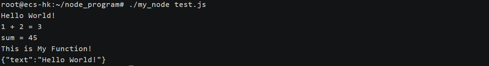

Node.js 是一个开源的、跨平台的 JavaScript 运行时环境，它允许开发者在服务器端运行 JavaScript 代码。Node.js 是基于 Chrome V8 引擎构建的，专为高性能、高并发的网络应用而设计，广泛应用于构建服务器端应用程序、网络应用、命令行工具等。

本系列将分为 9 篇文章为大家介绍 Node.js 技术原理：从[调试能力分析](https://mp.weixin.qq.com/s?__biz=MzU5ODA3OTY5Ng==&mid=2247498508&idx=1&sn=7e992f51177bba4c75ab4806bc882ccc&scene=21#wechat_redirect)到[内置模块新增](https://mp.weixin.qq.com/s?__biz=MzU5ODA3OTY5Ng==&mid=2247498516&idx=1&sn=0be4fd5bf9277d603d4b726ae648eefe&scene=21#wechat_redirect)，从[性能分析工具 perf_hooks 的用法](https://mp.weixin.qq.com/s?__biz=MzU5ODA3OTY5Ng==&mid=2247498541&idx=1&sn=5d58e7b1520ba92793fcd6519bf2f108&scene=21#wechat_redirect)到  [Chrome DevTools 的性能问题剖析](https://mp.weixin.qq.com/s?__biz=MzU5ODA3OTY5Ng==&mid=2247498602&idx=1&sn=700b62e90ab488ee3f87cbce6ddd304b&scene=21#wechat_redirect)，再到  [ABI 稳定的理解](https://mp.weixin.qq.com/s?__biz=MzU5ODA3OTY5Ng==&mid=2247498628&idx=1&sn=79c50ee08761a8c5791ba7dbe3376a42&scene=21#wechat_redirect)、基于 V8 封装 JavaScript 运行时、模块加载方式探究、内置模块外置以及 Node.js addon 的全面解读等主题，每一篇都干货满满。

在上一节中我们探讨了  Node.js 中的 ABI 稳定相关内容，在本节中则主要分享《基于 V8 封装一个自己的 JavaScript 运行时》相关内容，本文内容为本系列第 6 篇，由体验技术团队曹杨毅原创，以下为正文内容。

## 前言

Google 推出的 V8 引擎，自 2008 年随 Chrome 浏览器面世以来，大幅提升了 JavaScript 性能，重新定义了其应用范畴。作为 Chrome 和 Node.js 的核心动力，V8 推动 JavaScript 成为了一个跨越前后端的全栈开发语言。

但是 V8 本身只是一个 JavaScript 解释器，能够对 JavaScript 语言进行解释，并不具备与操作系统，或者其他软件或者资源交互的能力。但是在代码执行中， 我们往往根据我们的需要调用计算机的某些资源或者和其他软件发生交互。 为了使用户能够根据自己的需要，使用 JavaScript 脚本去完成自己的某些目的， V8 解释器提供了丰富的 API 使我们能够方便的根据自己的需要去扩展扩展 JavaScript 脚本的能力，例如：使用 Node.js 执行的 JavaScript 脚本具备文件操作和网络功能，在浏览器中执行的 JavaScript 脚本具备操作 HTML 文档的能力。这也是我们平时使用的最多的 JavaScript 运行时。

相比起浏览器（包括完整网络功能和 HTML 文本渲染系统）这样的 Javascript 运行时，node（只是提供了一些调用操作系统的 API）能够帮助我们能更加直观的去理解 JavaScript 运行时的实现和工作原理。文件的操作和向控制台输出是 node 具备的两种基础的能力。在接下来的叙述中，本文通过实现一个具备文件写和向控制台输出能力的 JavaScript 运行时，来向大家展示在浏览器和 node 中是如何使用 V8 的。

## 实验目标

在这个迷你运行时中实现这样的 2 个 JavaScript 接口：

- function print(data: string):  void;

往标准输出流输出字符串，该功能跟大家所熟悉的各大编程语言中的 print 函数是一样的。

- function writeFile(path: string, data: string):   void;

往文件里面写入字符串。

当我们的运行时做好之后，我们应该能用它去执行这样的一段 JavaScript 代码

```js
print('Hello World!')
// 预期应该能在命令行终端打印出：Hello World!

writeFile('test.txt', 'Hello World!')
// 预期应该能生成test.txt，并在txt文档里面写入了一个字符串：Hello World!
```

## 获取 V8 静态库

我们使用 V8 来构建我们的 JavaScript 运行时，我们需要在项目中做两件事情：第一件事是在项目中包含 V8 的头文件，第二件事是在项目中包含该依赖的动态库或者静态库。（本文采用了在 C++ 中引入库最简单的方式在构建阶段直接引入静态库）。

我们先构建一个 V8 的静态库，然后再将该库引入到我们的项目中。在 V8 静态库的构建过程中，会涉及一些访问外网下载依赖的过程，所以需要确保自己的环境是能通外网的（挂代理或者直接购买使用香港、新加坡等 region 的云服务器）。

在机器上执行如下命令，进行 V8 的构建（建议使用非 root 用户）

    # 准备谷歌的工具包
    git clone https://chromium.googlesource.com/chromium/tools/depot_tools.git
    pushd depot_tools
    git checkout bb2fc21a89ff58de78a2d3361a8adfca2975f773
    popd
    exportPATH=`pwd`/depot_tools:$PATH

    # 更新依赖，这一步花时间比较久。更新完成之后它会打出帮助文档，属于正常现象。
    gclient

    # 下载 V8 工程代码，进入源码工程中，切换到 12.4.1 版本
    fetch v8
    cd v8
    git checkout 22fed79ddf53976802b5275e8831776b11ac0faa

    # 切完分支需要执行一次 gclient sync 操作
    gclient sync

    # 生成配置文件
    tools/dev/v8gen.py x64.release.sample

    # 把 V8 代码编译成静态链接库
    ninja -C out.gn/x64.release.sample v8_monolith

生成 V8 的静态库 libv8_monolith.a， 我们将我们需要的头文件（ V8 源码里面的 include 文件夹）和该静态库取出来备用。

## 编写主程序

在 my_file.cc 中，我们用 C++ 实现 Example::print 函数以及 Example::print 函数

```C++
// function writeFile(path: string, data: string): void; 
voidExample::WriteFile(constFunctionCallbackInfo<Value> &args) {
    Isolate* isolate = args.GetIsolate();
    v8::String::Utf8Valuestr(isolate, args[1]);
    v8::String::Utf8Valuepath(isolate, args[0]);
    FILE* outFile = fopen(*path, "w");
    if (outFile != nullptr) {
        fputs(*str, outFile);
        fclose(outFile);
    } else {
        fprintf(stderr, "Unable to open file: %s\n", *path);
    }
}

// function print(data: string): void;
voidExample::Print(constFunctionCallbackInfo<Value> &args) {
    Isolate* isolate = args.GetIsolate();
    v8::String::Utf8Valuestr(isolate, args[0]);
    printf("%s\n", *str);
}
```

将我们用 C++ 实现的函数注入到 JavaScript 执行环境中

```C++
void register_builtins(Isolate* isolate, Local<Object> global) {
    // 创建 Example 对象模板
    Local<ObjectTemplate> Example = ObjectTemplate::New(isolate);
    // 设置 Example 对象的方法
    Example->Set(
      String::NewFromUtf8(isolate, "print", NewStringType::kNormal).ToLocalChecked(),
      FunctionTemplate::New(isolate, Example::Print)
    );
    Example->Set(
      String::NewFromUtf8(isolate, "writeFile", NewStringType::kNormal).ToLocalChecked(),
      FunctionTemplate::New(isolate, Example::WriteFile)
    );

    // 将 Example 对象挂到 global 对象上
    Local<Object> exampleInstance = Example->NewInstance(isolate->GetCurrentContext()).ToLocalChecked();
    global->Set(isolate->GetCurrentContext(), String::NewFromUtf8(isolate, "example", NewStringType::kNormal).ToLocalChecked(), exampleInstance).FromJust();
}
```

接着 V8 的 API 来构造我们的主程序，这部分内容比较固定。主要就是使用 V8 来创建一个 JavaScript 的执行环境用来执行我们的 JavaScript 代码，我们在 V8 官方示例上按需稍加修改就行。

```js
using namespace v8;
using namespace Example;

int main(int argc, char* argv[]) {
V8::InitializeICUDefaultLocation(argv[0]);
V8::InitializeExternalStartupData(argv[0]);
std::unique_ptr<Platform> platform = platform::NewDefaultPlatform();                                                    // V8 的一些通用初始化逻辑
V8::InitializePlatform(platform.get());
V8::Initialize();
Isolate::CreateParams create_params;                                                                                    // 创建 Isolate 时传入的参数
  create_params.array_buffer_allocator = ArrayBuffer::Allocator::NewDefaultAllocator();
Isolate* isolate = Isolate::New(create_params);                                                                         // 创建一个 Isolate，V8 的对象
  {
    Isolate::Scopeisolate_scope(isolate);
    HandleScopehandle_scope(isolate);                                                                                    // 创建一个 HandleScope，用于下面分配 Handle
    Local<ObjectTemplate> global = ObjectTemplate::New(isolate);                                                          // 创建一个对象模版，用于创建全局对象
    Local<Context> context = Context::New(isolate, nullptr, global);                                                      // 创建一个上下文
    Context::Scopecontext_scope(context);
    Local<Object> globalInstance = context->Global();                                                                     // 获取 JS 全局对象
    register_builtins(isolate, globalInstance);                                                                           // 注册 C++ 模块
    {
      if(argc < 2) {
        fprintf(stdout, "Usage: %s filename\n", argv[0]);
        return1;
      }
      char* filename = argv[1];                                                                                           // 打开 JS 文件,将 JS 文件内容读取到内存
      int fd = open(filename, 0, O_RDONLY);
      struct stat info;
      fstat(fd, &info);
      char *ptr = (char *)malloc(info.st_size + 1);
      read(fd, (void *)ptr, info.st_size);
      ptr[info.st_size] = '\0';

      Local<String> source = String::NewFromUtf8(isolate, ptr, NewStringType::kNormal, info.st_size).ToLocalChecked();    // 要执行的 JS 代码
      Local<Script> script = Script::Compile(context, source).ToLocalChecked();                                           // 将 JS 代码编译成字节码
      free(ptr);                                                                                                          // 内存中的 JS 代码已经用不上了，释放掉这部分内存
      script->Run(context).ToLocalChecked();                                                                              // 执行 JS
    }
  }

  isolate->Dispose();
v8::V8::Dispose();
delete create_params.array_buffer_allocator;
return0;
}
```

## 功能验证

首先将我们的“迷你运行时”编译出来，得到一个可执行文件 my_node（这个名字是我们编译的时候设置的）

接下来我们就能使用我们熟悉的 JavaScript 语法来编写我们的 JavaScript 代码。

我们编写了一段测试用例，用来测试我们的 print 函数和 writeFile 函数是否正常使用。为了表现出 V8 引擎的功能是正常的，我们这里把用例稍微多写几句，多使用一些 JavaScript 语法

```js
const { print, writeFile } = example;

// 简单测试我们实现的 print 函数
print("Hello World!");

// 简单测试我们实现的 writeFile 函数
writeFile("test.txt", "Hello World!");

// 测试 class 关键字
classA{
    sum(a, b){
        return  a + b;
    }
}
let a = newA();
print("1 + 2 = " + a.sum(1, 2));

// 测试 for 关键字
let sum = 0;
for(let i = 0; i < 10; i++){
    sum += i;
}
print("sum = " + sum);

// 测试 function 关键字
functionfunc(){
    print("This is My Function!");
}
func();

// 测试 json 序列化
print(JSON.stringify({TEXT: 'Hello World!'}));
```

接下来使用我们的“迷你运行时”来执行这个文件，发现它们均能够顺利执行。



## 小结

本文旨在帮助大家理解在 node 和浏览器中是如何使用 V8 的，在 node 当中通过本文叙述的方式使用 V8 API 向 JavaScript 执行环境中注入了文件操作和网络通讯相关的函数，在浏览器中则 使用 V8 API 向 JavaScript 执行环境中注入了 DOM API 来操作 HTML 文档

**完整代码：**

**<https://github.com/caoyangyicn/my_node>**

**参考链接：**

**<https://juejin.cn/post/7213994652487172151>**

**<https://v8.dev/docs/embed>**

---

下一节，将分享《Node.js 模块加载方式分析》相关内容，请大家持续关注本系列内容\~学习完本系列，你将获得：

- 提升调试与性能优化能力

- 深入理解模块化与扩展机制

- 探索底层技术与定制化能力

同时欢迎大家给 OpenTiny 提建议：[【OpenTiny 调研征集】共创技术未来，分享您的声音！](https://mp.weixin.qq.com/s?__biz=MzU5ODA3OTY5Ng==&mid=2247498532&idx=1&sn=56678cf1078debef902d24c418dda725&scene=21#wechat_redirect)

## 关于 OpenTiny

欢迎加入 OpenTiny 开源社区。添加微信小助手：opentiny-official 一起参与交流前端技术～\
OpenTiny 官网：**<https://opentiny.design>**\
OpenTiny 代码仓库：**<https://github.com/opentiny>**\
TinyVue 源码：**<https://github.com/opentiny/tiny-vue>**\
TinyEngine 源码： **<https://github.com/opentiny/tiny-engine>**\
欢迎进入代码仓库 Star🌟TinyEngine、TinyVue、TinyNG、TinyCLI\~ 如果你也想要共建，可以进入代码仓库，找到 good first issue 标签，一起参与开源贡献\~
