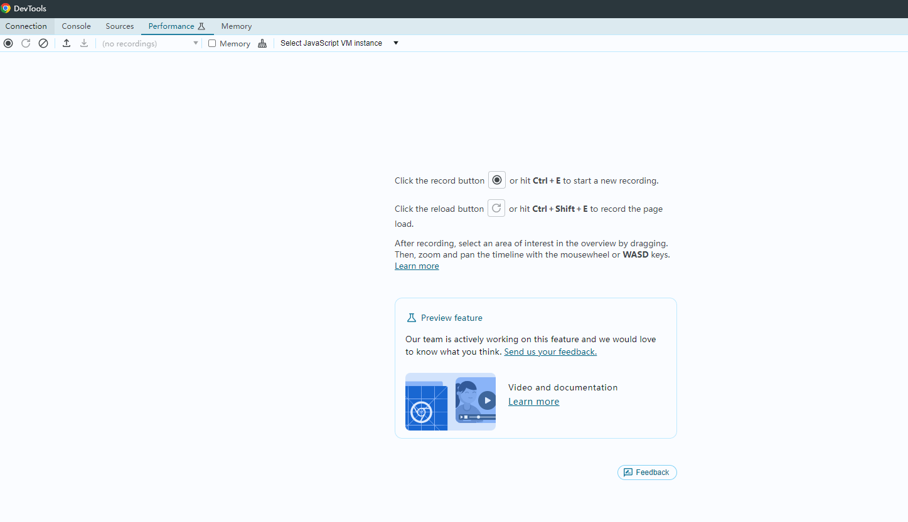
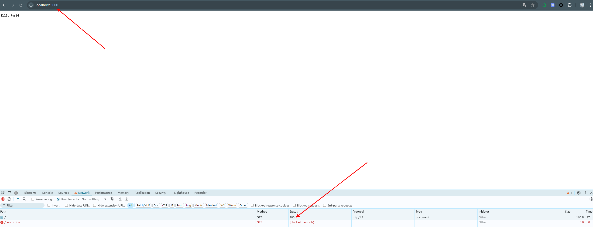
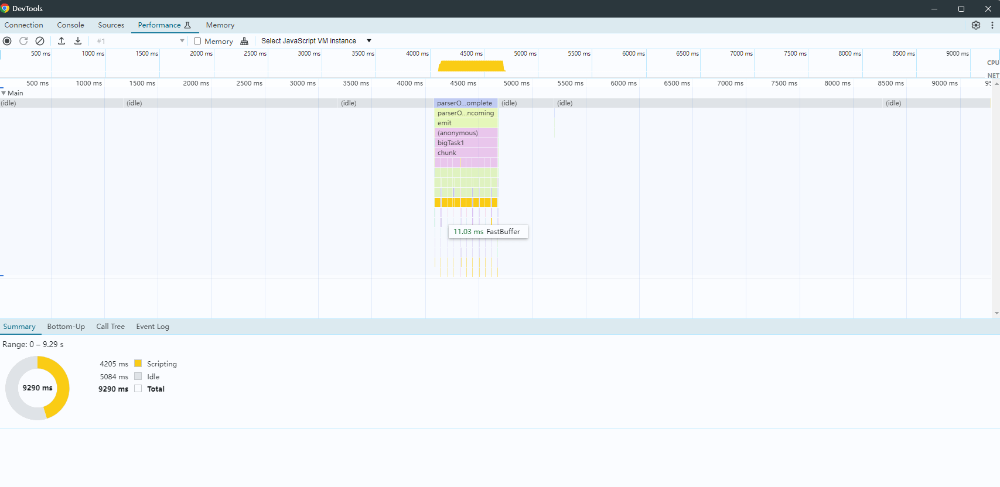
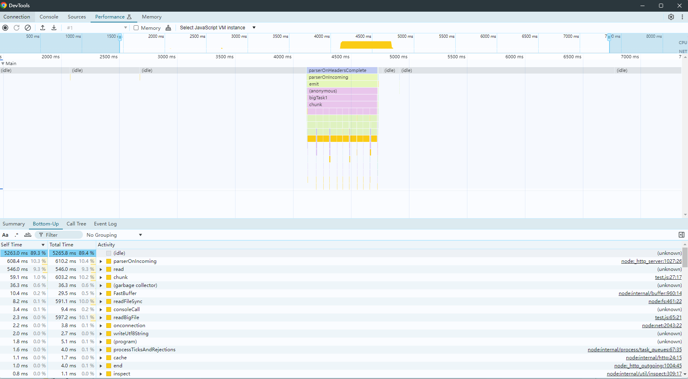
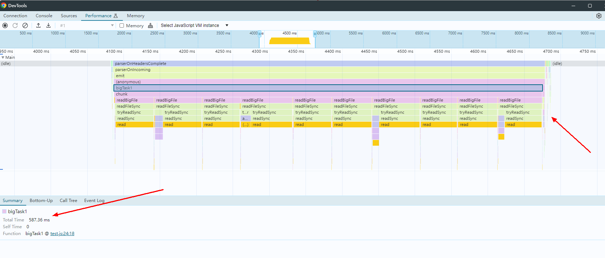
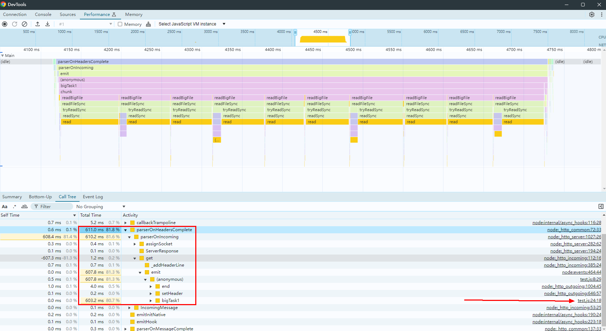
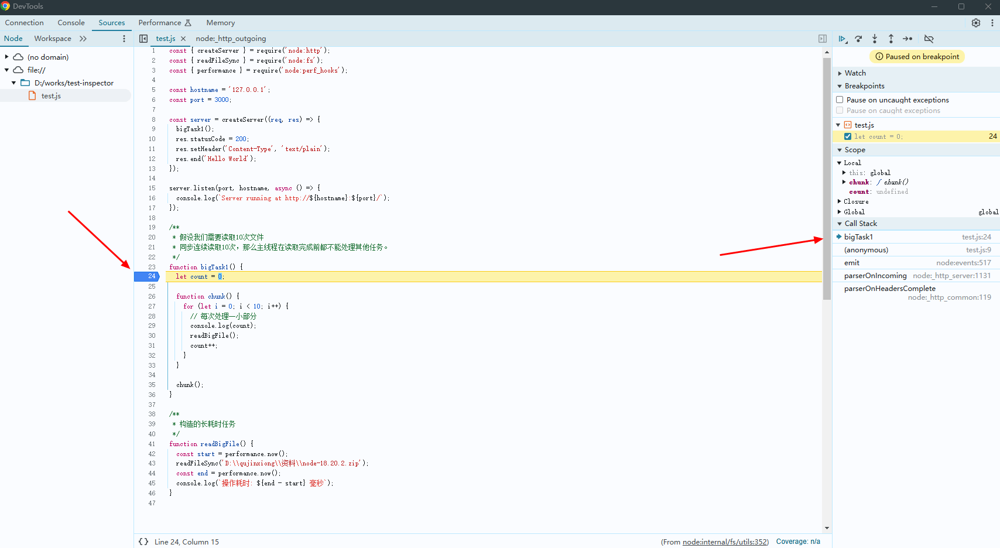
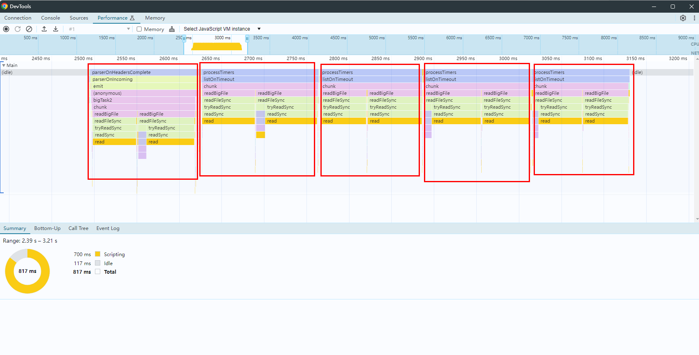

Node.js 是一个开源的、跨平台的 JavaScript 运行时环境，它允许开发者在服务器端运行 JavaScript 代码。Node.js 是基于 Chrome V8 引擎构建的，专为高性能、高并发的网络应用而设计，广泛应用于构建服务器端应用程序、网络应用、命令行工具等。

本系列将分为 9 篇文章为大家介绍 Node.js 技术原理：从[调试能力分析](https://mp.weixin.qq.com/s?__biz=MzU5ODA3OTY5Ng==&mid=2247498508&idx=1&sn=7e992f51177bba4c75ab4806bc882ccc&scene=21#wechat_redirect)到[内置模块新增](https://mp.weixin.qq.com/s?__biz=MzU5ODA3OTY5Ng==&mid=2247498516&idx=1&sn=0be4fd5bf9277d603d4b726ae648eefe&scene=21#wechat_redirect)，从[性能分析工具 perf_hooks 的用法](https://mp.weixin.qq.com/s?__biz=MzU5ODA3OTY5Ng==&mid=2247498541&idx=1&sn=5d58e7b1520ba92793fcd6519bf2f108&scene=21#wechat_redirect)到 Chrome DevTools 的性能问题剖析，再到 ABI 稳定的理解、基于 V8 封装 JavaScript 运行时、模块加载方式探究、内置模块外置以及 Node.js addon 的全面解读等主题，每一篇都干货满满。

在上一节中我们探讨了  Node.js 的 perf_hooks 模块作用和用法，在本节中则主要分享使用 Chrome DevTools 分析 Node.js 性能问题，本文内容为本系列第 4 篇，由体验技术团队屈金雄原创，以下为正文内容。

## 知识准备

无论是学会使用 Node.js 性能分析工具，还是解决性能问题，都要理解运行原理，其中有几个点尤为重要，这里仅提及一下，包括单线程、事件循环、异步、宏任务、微任务等。阮一峰的 《JavaScript 运行机制详解：再谈 Event Loop》，这篇文章讲的很好，但是不够全面，有些点甚至过时了。如果需要更准确深入的了解 Node.js 运行原理，恐怕只能去啃源码了。

《JavaScript 运行机制详解：再谈 Event Loop》：<https://www.ruanyifeng.com/blog/2014/10/event-loop.html>

## Performance 面板介绍

Chrome DevTools 中的 Performance 面板和 Chrome 开发者工具中的 Performance 面板不是同一个，前者用于 Node.js 性能分析，后者用于 web 前端性能分析。 如下图所示，Chrome DevTools 的 Performance 面板包括以下四个区域：

1. 操作区
2. 时间轴：包括从记录开始到记录结束这个时间段。
3. 概览区：目前只能看主线程活动，以后也许能看更多内容。
4. 详情区：详情区的内容会随鼠标左键选中的目标变化而变化。


## 火焰图

火焰图在很多性能分析工具中都有实现，Chrome DevTools 中的实现就是前面提到的主线程活动（点击 Main 旁边的三角可以收缩/展开这个区域）。 读懂火焰图需要理解以下几个关键点：

1. 火焰图是由很多色块堆叠（内层函数堆叠在外层函数下面）而成，每一个色块对应一个函数。

2. 函数耗时用宽度表示。我们可以通过肉眼观察色块宽度，来发现哪个函数耗时最长。

3. 最上面一层都是一个宏任务对应的任务（这个很关键），宏任务之间是异步的，不会阻塞。

## 举例说明

### **一、构造有性能问题的代码**

如下代码所示，函数 bigTask1 是构造的有性能问题的代码。这个函数将一个比较大的文件读取 10 次。我们模拟一下平时常见的业务场景，用 node 编写一个迷你的 web 后端服务，将这个函数放在一个请求的回调函数中，通过发起请求来触发执行。

```js
const { createServer } = require('node:http');
const { readFileSync } = require('node:fs');
const { performance } = require('node:perf_hooks');

const hostname = '127.0.0.1';
const port = 3000;

const server = createServer((req, res) => {
  bigTask1();
  res.statusCode = 200;
  res.setHeader('Content-Type', 'text/plain');
  res.end('Hello World');
});

server.listen(port, hostname, async () => {
  console.log(`Server running at http://${hostname}:${port}/`);
});

/**
 * 假设我们需要读取10次文件
 * 同步连续读取10次，那么主线程在读取完成前都不能处理其他任务。
 */
functionbigTask1() {
  let count = 0;

functionchunk() {
    for (let i = 0; i < 10; i++) {
      // 每次处理一小部分
      console.log(count);
      readBigFile();
      count++;
    }
  }

  chunk();
}


/**
 * 构造的长耗时任务
 */
functionreadBigFile() {
  const start = performance.now();
  readFileSync('D:\qujinxiong\资料\node-18.20.2.zip');
  const end = performance.now();
  console.log(`操作耗时: ${end - start} 毫秒`);
}
```

### **二、启动服务并连接**

具体操作在[Node.js 调试能力分析](https://mp.weixin.qq.com/s?__biz=MzU5ODA3OTY5Ng==&mid=2247498508&idx=1&sn=7e992f51177bba4c75ab4806bc882ccc&scene=21#wechat_redirect)  中有介绍，这里不再赘述。 连接成功后，切换到 Chrome DevTools 的 Performance 面板，结果如下图所示：



### **三、点击 DevTools 左上角录制按钮（Record 按钮），开始录制**

### **四、向服务器发起一次请求**



打开新的标签页，向服务器发起一次请求

### **五、点击 DevTools 左上角录制按钮（Record 按钮），停止录制**

步骤三、四、五的操作是为了记录发起请求后的性能数据，如下图所示：



### **六、分析性能数据，定位问题**

采集到正确的性能数据后，可以按照以下三步来逐步定位问题：

- **第一步：Bottom-Up 分析**\
   由于数据量太大，我们需要工具帮助我们初步锁定问题。这个步骤一般来说是性能数据分析的第一步。 如下图所示，这个面板下方，用列表展示各个函数自身耗时，通过这个列表可以一眼看出耗时最长的函数，这里是 parserOnIncoming 函数，耗时 608.4ms。 一般来说单函数耗时超 50ms 就值得关注了，性能问题可能就出在这种函数中。 Tips：图中 read 函数共执行了 10 次，列表中的 546.0ms 是 10 次之和。



<!---->

- **第二步：火焰图分析**\
   鼠标悬停在火焰图上，可以放大火焰图。 上一步找到大函数后，我们可以在放大的火焰图上找到该函数，对大函数进一步分析。 放大后，可以看到 10 次大文件读取都在一个宏任务中同步读取，同步读取 10 次大文件期间，主线程是阻塞的，读取需要多长时间，就阻塞多长时间，这里是 587ms。 至此，我们定位到了开头构造的问题。



<!---->

- **第三步：Call Tree 分析**\
   这个面板，算是对火焰图的列表形式的展示。 如下图所示，我们通过火焰图找到大函数 parserOnIncoming 的最上层函数 paserOnHeadersComplete 后，一步步展开 paserOnHeadersComplete，可以找到 bigTask1，这是我们自己写的代码。至此，我们定位到了问题代码的位置，从右侧给出的文件链接，我们还能直接打开文件，详细分析代码。



在打开的文件中我们甚至可以加断点，再次触发该代码的执行，即可开始调试。



### **七、通过拆分宏任务实现优化**

```js
const { createServer } = require('node:http');
const { readFileSync } = require('node:fs');
const { performance } = require('node:perf_hooks');

const hostname = '127.0.0.1';
const port = 3000;

const server = createServer((req, res) => {
  bigTask2();
  res.statusCode = 200;
  res.setHeader('Content-Type', 'text/plain');
  res.end('Hello World');
});

server.listen(port, hostname, async () => {
  console.log(`Server running at http://${hostname}:${port}/`);
});


/**
 * 将10次读取任务拆分的5个宏任务中
 * 这样的话，在5个宏任务的间隙，主线程可以继续处理其他任务，而不会阻塞
 */
functionbigTask2() {
  let count = 0;

  functionchunk() {
    for (let i = 0; i < 2; i++) {
      // 每次处理一小部分
      console.log(count);
      readBigFile();
      count++;
    }
    if (count < 10) {
      console.log('next macro!');
      setTimeout(chunk, 0); // 递归调用，延迟0毫秒继续处理下一部分
    }
  }

  chunk();
}

/**
 * 构造的长耗时任务
 */
functionreadBigFile() {
  const start = performance.now();
  readFileSync('D:\qujinxiong\资料\node-18.20.2.zip');
  const end = performance.now();
  console.log(`操作耗时: ${end - start} 毫秒`);
}
```

如上代码所示，同样是读取 10 次大文件，在 bigTask2 中，我们通过 setTimeout（这是一个宏任务），将 chunk 中的 10 次大文件读取，拆分到 5 个宏任务中，每个宏任务中读取两次。 这样由于宏任务是异步执行，5 个宏任务之间的间隙，主线程可以继续执行其他同步代码。 优化后火焰图如下所示：



---

下一节，将分享《理解 Node.js 中的 ABI 稳定》相关内容，请大家持续关注本系列内容\~学习完本系列，你将获得：

- 提升调试与性能优化能力

- 深入理解模块化与扩展机制

- 探索底层技术与定制化能力

同时欢迎大家给 OpenTiny 提建议：[【OpenTiny 调研征集】共创技术未来，分享您的声音！](https://mp.weixin.qq.com/s?__biz=MzU5ODA3OTY5Ng==&mid=2247498532&idx=1&sn=56678cf1078debef902d24c418dda725&scene=21#wechat_redirect)

## 关于 OpenTiny

欢迎加入 OpenTiny 开源社区。添加微信小助手：opentiny-official 一起参与交流前端技术～\
OpenTiny 官网：**<https://opentiny.design>**\
OpenTiny 代码仓库：**<https://github.com/opentiny>**\
TinyVue 源码：**<https://github.com/opentiny/tiny-vue>**\
TinyEngine 源码： **<https://github.com/opentiny/tiny-engine>**\
欢迎进入代码仓库 Star🌟TinyEngine、TinyVue、TinyNG、TinyCLI\~ 如果你也想要共建，可以进入代码仓库，找到 good first issue 标签，一起参与开源贡献\~
