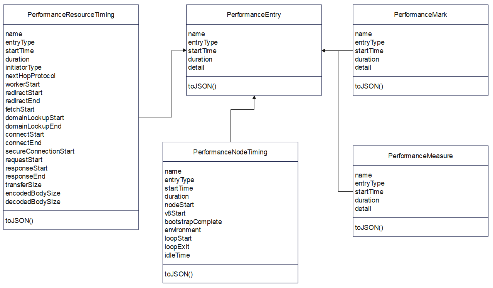
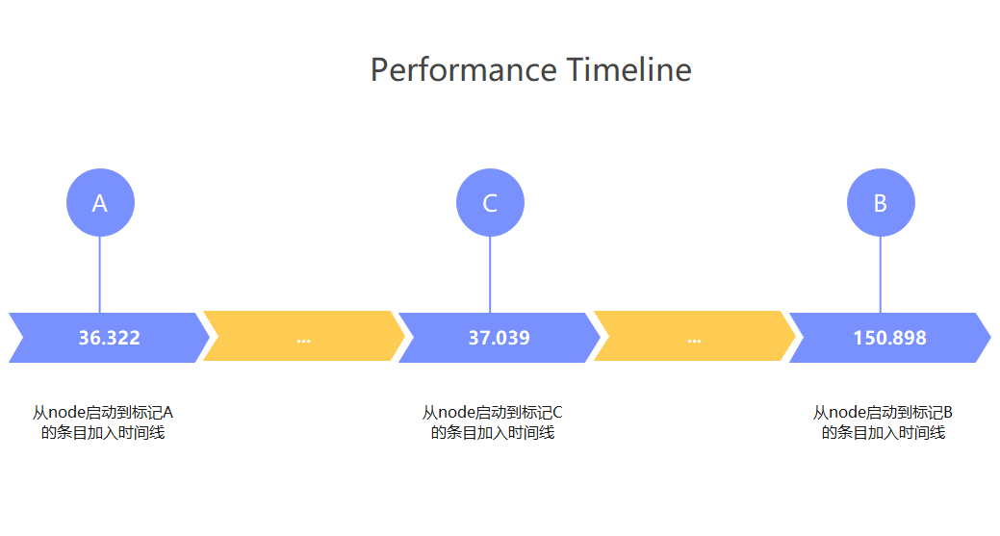

Node.js 是一个开源的、跨平台的 JavaScript 运行时环境，它允许开发者在服务器端运行 JavaScript 代码。Node.js 是基于 Chrome V8 引擎构建的，专为高性能、高并发的网络应用而设计，广泛应用于构建服务器端应用程序、网络应用、命令行工具等。

本系列将分为 9 篇文章为大家介绍 Node.js 技术原理：从[Node.js 调试能力分析](https://juejin.cn/post/7471095146848337954)到[如何在 Node.js 中新增一个内置模块](https://juejin.cn/post/7472205627570274344)，从性能分析工具 perf_hooks 的用法到 Chrome DevTools 的性能问题剖析，再到 ABI 稳定的理解、基于 V8 封装 JavaScript 运行时、模块加载方式探究、内置模块外置以及 Node.js addon 的全面解读等主题，每一篇都干货满满。

在上一节中我们探讨了如何在 Node.js 中新增一个内置模块，在本节中则主要分享 Node.js 的 perf_hooks 模块作用和用法，本文内容为本系列第 3 篇，由体验技术团队屈金雄原创。以下为正文内容。

## 前言

在 Node.js 中，如何测量一段代码的耗时呢？

比如 for 循环遍历 100 次的耗时。让我们带着这个问题，开始本文的讲解。

**1.用  `Date.now()`**

很容易就能想到，在循环前后分别取一个时间，再相减不就行了

```js
const start = Date.now()
for (let i = 0; i < 100; i++) {
  // ...
}
const end = Date.now()
console.log(`Execution time: ${end - start}ms`)
```

运行多次后发现，结果永远是 0。原因是  `Date.now()`  只能精确到毫秒级别，无法用于计算零点几毫秒这种的耗时。

**2.用  `console.time()`  和  `console.timeEnd()`**

```js
console.time('example')
for (let i = 0; i < 100; i++) {
  // ...
}
console.timeEnd('example')
```

运行上述代码，在控制台打印：example: 0.179ms。 目的是达到了，但是这种方法仅适用于在控制台打印结果。如果要放到日志中，就不行了。

**3.使用一些三方库**

这样的三方库当然是有的，比如 benchmark.js 库，也能提供高精度时间戳。但问题就在于这些库是第三方的，如果 Node.js 本身的代码需要测试或记录性能数据，三方库就不再可用了。

在本文主角 perf_hooks 模块出现之前，还有更多的解决方案被采用，这里就不再列举。总之，我们需要 Node.js 自己的模块。 在 2017 年，也就是 node 8.5 版本发布时，就有了  **perf_hooks 模块，用来提供高精度时间戳，测试代码耗时**。

接下来我们探索一下，这个模块的用法。 由于 node 官方文档总是很简洁，很少写为什么，像字典一样。我们习惯性的全网搜索好心人提供的新手教程，但是这次失败了，关于 perf_hooks 介绍的文档很少。无奈之下，回到官方文档。

官方文档一开头就给出了一个示例：

```js
const { PerformanceObserver, performance } = require('node:perf_hooks')

const obs = newPerformanceObserver((items) => {
  console.log(items.getEntries()[0].duration)
  performance.clearMarks()
})
obs.observe({ type: 'measure' })
performance.measure('Start to Now')

performance.mark('A')
doSomeLongRunningProcess(() => {
  performance.measure('A to Now', 'A')

  performance.mark('B')
  performance.measure('A to B', 'A', 'B')
})
```

相信初学的你和我一样，有十万个为什么想问

- 为什么用起来和我想象的不一样？
- 为什么要 new PerformanceObserver？
- PerformanceObserver 是干什么的？
- ...

<!---->

这时我们只有最后一招了，啃源码。其中过程与艰辛不表，只讲源码中啃出的结论，开头问题的解法会附在解说示例中。

本文使用的 Node.js 源码是 18.20.2。

## 运行原理

讲运行原理之前，我们得先明白三个基本概念，就像我们学习编程语言之前，会不会写代码不要紧，总得先把变量、函数、类和对象，这些基本概念先熟悉一下，才能学习语句、api 等。

### 三个基本概念

- **高精度时间戳**

  本章第一个示例就告诉我们，想要计算代码耗时，先得有高精度时间戳。

  perf_hooks 模块使用的时间戳都是高精度时间戳，依赖的底层 api 是  `process.hrtime()`，单位是毫秒（ms），保留 14 位小数点，例如 35.87660002708435。

  与通常意义的时间戳不同，高精度时间戳表示从 Node.js 进程启动到记录时间，中间间隔的时长。例如  `performance.now()`  返回的是 Node.js 进程启动到 now 方法执行时的时长。

  这种设计可以避免操作系统时钟对精度的影响，适合 Node.js 性能度量。

<!---->

- **PerformanceEntry**

  其中的 entry 翻译为条目最合适。 PerformanceEntry 是 perf_hooks 模块用来表示单条性能数据的数据结构，它有四个子类分别是 PerformanceNodeTiming、PerformanceResourceTiming、PerformanceMark 和 PerformanceMeasure。

  一般来说，开发者不需要直接操作这几个类。

  下图是简化后的示意图，实际层级关系比图中更多。



<!---->

- **Performance Timeline**

  Performance Timeline 这个关键词，在文档中出现了 17 次，但是并没有介绍它是什么。Web Performance API 关于 Performance Timeline 的介绍，看起来和 perf_hooks 的源码又不相符。所以，我们根据 perf_hooks 源码和官方文档，可以做个未论证的推论，方便我们建立基本认知。

  推论：Performance Timeline 是一个全局的变量，类型是数组，数组元素是 PerformanceEntry 类型的对象。

### 运行原理讲解

理解了前面两个基本概念，运行原理就好讲了。可以自行脑补一下，内存中有个数组，称呼为 Performance Timeline，用于按时间顺序存放一条条的性能数据。

那么接下来，分别实现向 timeline 数组中写入、读取等能力，就可以基本满足这个性能模块的需求了，具体实现在后面的章节会讲。

接下来用一个示例进一步说明运行原理：

```js
const { performance, PerformanceObserver } = require('perf_hooks')

// 创建一个 PerformanceObserver 实例
const obs = newPerformanceObserver((list) => {
  // 获取性能条目列表中的所有条目
  const entries = list.getEntries()
  entries.forEach((entry) => {
    console.log(`${entry.name}: ${entry.startTime}`)
  })
})

// 监听 'mark' 类型的性能条目
obs.observe({ entryTypes: ['mark'] })

// 创建性能标记和测量
performance.mark('A') // 创建标记 'A'
setTimeout(() => {
  performance.mark('B') // 创建标记 'B'
}, 100)

performance.mark('C') // 创建标记 'C'
```

如上代码打印的时间数据，如下图：


可以看到打印了 A、B、C 三个条目的 startTime，对应的时间轴示意图如下图：



### 向 timeline 写数据

perf_hooks 直译是性能钩子。其实 hook 翻译为挂钩更为贴切。挂钩一端固定在软件系统上，至于挂钩上挂什么，由用户决定，总之挂的东西（代码）会被执行，执行时机由系统决定。那 perf_hooks 体系中的 hooks 具体是指什么呢？

性能数据（PerformanceEntry）分为 node、mark、measure、gc、function、http、http2 等几种类型。续接前文提到的挂钩，向 timeline 写数据，实际是在 node 系统上放置挂钩。除了 mark 和 measure，其他几种类型挂钩已经提前放好了（内置）。

mark 和 measure 对应的函数就是封装后的挂钩（包括了钩子函数和定义好的函数内容），它们可以搭配使用，测量指定两个挂钩执行的时间差，这个时间差可以称为自定义指标。准确来说 mark 挂钩（performance.mark）用来在指定代码位置收集执行时间等性能数据，measure 挂钩（performance.measure）用来计算两个挂钩的时间差。

简单来说，`performance.mark('A')`执行时，会创建一条 PerformanceMark（也是 PerformanceEntry 的子类）类型的条目，并写入 timeline；`performance.measure('A')`执行时，会创建一条 PerformanceMeasure（也是 PerformanceEntry 的子类）类型的条目，并写入 timeline。

### 从 timeline 查询数据

从 timeline 查询数据的方式有两种，一种同步方式，一种是异步方式。为避免查询 timeline 数据的代码本身，对性能造成影响，通常推荐的方式是异步方式。

- #### 同步方式查询

以下三个方法用于同步地从 timeline 查询性能数据，返回 timeline 完整数据或其子集。

- `performance.getEntries()`
- `performance.getEntriesByName(name[, type])`
- `performance.getEntriesByType(type)`

如下两个示例中，查询代码是同步执行的，如果 timeline 上的性能数据过多，查询动作会明显阻塞主线程。

**示例代码 1：**

```js
// test_perf_hooks.js

performance.mark('A')
console.log(performance.getEntries()[0])
```

**这个示例中，** `performance.mark('A')`创建了一条 PerformanceMark 类型的数据，并添加到 timeline 中；`performance.getEntries()`取到当前 timeline 中的所有数据，它是一个数组，此时数组中只有一条数据；`performance.getEntries()[0]`取到第一条数据。

用  `node test_perf_hooks.js`  命令，运行这个文件，打印结果如下：

```js
PerformanceMark {
  name: 'A',
  entryType: 'mark',
  startTime: 28.137699961662292,
  duration: 0,
  detail: null
}
```

结果中 startTime 的值是从 node 进程启动到这条数据创建时的毫秒数；duration 表示时长，PerformanceMark 类型的数据不存在时长，值都是 0。

**示例代码 2：**

这个示例就解决了文章开头提出的疑问。缺点是示例中的查询是同步的。

```js
// test_perf_hooks.js

performance.mark('A')
for (let i = 0; i < 100; i++) {
  // ...
}
performance.mark('B')
performance.measure('A to B', 'A', 'B')
console.log(performance.getEntriesByName('A to B')[0])
```

`performance.getEntriesByName('A to B')`从 timeline 中查询出所有名称为'A to B'的数据，这里只有一条。 用  `node test_perf_hooks.js`  命令，运行这个文件，打印结果如下：

```js
PerformanceMeasure {
  name: 'A to B',
  entryType: 'measure',
  startTime: 28.32800006866455,
  duration: 0.14899992942810059,
  detail: null
}
```

这条 PerformanceMeasure 类型的数据，表示标记 A 到标记 B 所用时长，这里 for 循环 100 次耗时是 duration 的值 0.14899992942810059。

- #### 异步方式查询

以下三个方法用于异步地从 timeline 查询性能数据，同样返回 timeline 完整数据或其子集。

<!---->

- `performanceObserverEntryList.getEntries()`
- `performanceObserverEntryList.getEntriesByName(name[, type])`
- `performanceObserverEntryList.getEntriesByType(type)`

如下两个示例中，new PerformanceObserver 是在创建观察者，其构造函数入参是一个等待触发执行的函数，当监听的指定类型的条目数据被创建时，构造函数入参会被触发执行。本节所谓的异步，就是指定义在构造函数入参中的查询动作，时异步执行的，无论查询耗时多长，都不阻塞主线程。构造函数入参的入参是性能条目列表。

**示例代码 1：**

```js
const { performance, PerformanceObserver } = require('perf_hooks')

// 创建一个 PerformanceObserver 实例
const obs = newPerformanceObserver((list) => {
  // 获取性能条目列表中的所有条目
  const entries = list.getEntries()
  entries.forEach((entry) => {
    console.log(`${entry.name}: ${entry.startTime}`)
  })
})

// 监听 'measure' 类型的性能条目
obs.observe({ entryTypes: ['mark'] })

// 创建性能标记和测量
performance.mark('A') // 创建标记 'A'
```

最后一行的执行，触发`new PerformanceObserver`时入参函数的执行。

**示例代码 2：**

这个示例是本文开头问题的最优解。

```js
const { performance, PerformanceObserver } = require('perf_hooks')

// 创建一个 PerformanceObserver 实例
const obs = newPerformanceObserver((list) => {
  // 获取性能条目列表中的所有条目
  const entries = list.getEntries()
  entries.forEach((entry) => {
    console.log(`${entry.name}: ${entry.duration}`)
  })
})

// 监听 'measure' 类型的性能条目
obs.observe({ entryTypes: ['measure'] })

// 创建性能标记和测量
performance.mark('A') // 创建标记 'A'
for (let i = 0; i < 100; i++) {
  // ...
}
performance.mark('B') // 创建标记 'B'
performance.measure('A to B', 'A', 'B') // 创建 'A to B' 的测量条目
```

运行后，打印结果：A to B: 0.15059995651245117，与其他几种的结果相符。

## API 串讲

理解 Performance Timeline 是本模块的设计思想的关键所在。除了定义性能数据结构的 API，就是向 timeline 读写数据的 API。理解到了这一层，整个模块就算理解的差不多了。

## 一些使用场景及其示例

测量异步操作耗时

```js
'use strict'
const async_hooks = require('node:async_hooks')
const { performance, PerformanceObserver } = require('node:perf_hooks')

const set = newSet()
const hook = async_hooks.createHook({
  init(id, type) {
    if (type === 'Timeout') {
      performance.mark(`Timeout-${id}-Init`)
      set.add(id)
    }
  },
  destroy(id) {
    if (set.has(id)) {
      set.delete(id)
      performance.mark(`Timeout-${id}-Destroy`)
      performance.measure(`Timeout-${id}`, `Timeout-${id}-Init`, `Timeout-${id}-Destroy`)
    }
  }
})
hook.enable()

const obs = newPerformanceObserver((list, observer) => {
  console.log(list.getEntries()[0])
  performance.clearMarks()
  performance.clearMeasures()
  observer.disconnect()
})
obs.observe({ entryTypes: ['measure'], buffered: true })

setTimeout(() => {}, 1000)
```

测量模块加载耗时

```js
'use strict'
const { performance, PerformanceObserver } = require('node:perf_hooks')
const mod = require('node:module')

// Monkey patch the require function
mod.Module.prototype.require = performance.timerify(mod.Module.prototype.require)
require = performance.timerify(require)

// Activate the observer
const obs = newPerformanceObserver((list) => {
  const entries = list.getEntries()
  entries.forEach((entry) => {
    console.log(`require('${entry[0]}')`, entry.duration)
  })
  performance.clearMarks()
  performance.clearMeasures()
  obs.disconnect()
})
obs.observe({ entryTypes: ['function'], buffered: true })

require('some-module')
```

测量 HTTP 请求耗时

```js
'use strict'
const { PerformanceObserver } = require('node:perf_hooks')
const http = require('node:http')

const obs = newPerformanceObserver((items) => {
  items.getEntries().forEach((item) => {
    console.log(item)
  })
})

obs.observe({ entryTypes: ['http'] })

constPORT = 8080

http
  .createServer((req, res) => {
    res.end('ok')
  })
  .listen(PORT, () => {
    http.get(`http://127.0.0.1:${PORT}`)
  })
```

## 总结与回顾

文中推论，timeline 是一个全局变量，其实不准确，timeline 的准确构成和自动清除机制都存疑。但是这么理解能帮助我们快速建立对 perf_hooks 模块的基本认知。

下一节，将分享 使用 Chrome DevTools 分析 Node.js 性能问题，请大家持续关注本系列内容\~学习完本系列，你将获得：

- 提升调试与性能优化能力

- 深入理解模块化与扩展机制

- 探索底层技术与定制化能力

## 关于 OpenTiny

欢迎加入 OpenTiny 开源社区。添加微信小助手：opentiny-official 一起参与交流前端技术～\
OpenTiny 官网：**<https://opentiny.design>**\
OpenTiny 代码仓库：**<https://github.com/opentiny>**\
TinyVue 源码：**<https://github.com/opentiny/tiny-vue>**\
TinyEngine 源码： **<https://github.com/opentiny/tiny-engine>**\
欢迎进入代码仓库 Star🌟TinyEngine、TinyVue、TinyNG、TinyCLI\~ 如果你也想要共建，可以进入代码仓库，找到 good first issue 标签，一起参与开源贡献\~
