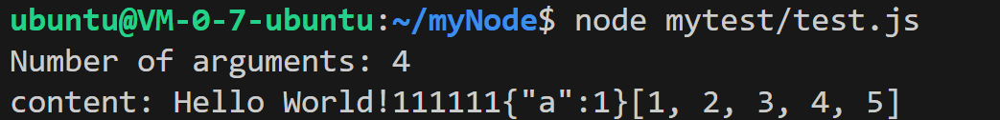

本文由体验技术团队曹杨毅原创。

Node.js 是一个开源的、跨平台的 JavaScript 运行时环境，它允许开发者在服务器端运行 JavaScript 代码。Node.js 是基于 Chrome V8 引擎构建的，专为高性能、高并发的网络应用而设计，广泛应用于构建服务器端应用程序、网络应用、命令行工具等。

本系列将分为 9 篇文章为大家介绍 Node.js 技术原理：从调试能力分析到内置模块新增，从性能分析工具 perf_hooks 的用法到 Chrome DevTools 的性能问题剖析，再到 ABI 稳定的理解、基于 V8 封装 JavaScript 运行时、模块加载方式探究、内置模块外置以及 Node.js addon 的全面解读等主题，每一篇都干货满满。

本文内容为本系列第 2 篇，以下为正文内容。

## 前言

作为 Node.js 的使用者，想必同学们对“内置模块”这个概念并不陌生：Node.js 内置模块也叫核心模块，预置在 Node.js 运行时中，这些内置模块不需要额外下载安装，可以在 js 代码中通过 require 引入。

常用的内置模块包括 fs、http 等

```js
const fs = require('fs')
const http = require('http')
const url = require('url')
```

对于这些天天使用的功能，大家有没有好奇过它们是怎么开发出来的呢？

为了更好地了解 Node.js 的底层实现，我把这套流程自己走了一遍。这里可以跟大家分享一下：如何基于 Node.js 开源代码定制开发，添加一组新的内置模块。

所有复杂的功能都是建立在简单的基础之上的，因此我们用作演示的这组内置模块不需要太复杂。我们就实现一个往标准输出流输出信息的功能吧，类似于 console.log() 功能。

我们要实现的效果是这样的：我们的内置模块开发完成之后，我们可以通过这样的一段 js 代码对它进行调用

```js
const my_console = require('my_console')
class a {
  constructor() {
    this.a = 1
  }
}
let b = new a()
arr = [1, 2, 3, 4, 5]
my_console.log('Hello World!', 111111, b, arr)
```

调用的结果是这样的


## 实现步骤

**1、编写核心源码**

我们选用 Node.js 22.7.0 源码进行改造，在 Node.js 的 src 文件夹下新增一个源码文件 my_console.cc，在这个文件中编写我们的 C++ 业务代码，实现我们上面提到的功能。

首先引入我们所需要使用的头文件。

为了让我们的程序具备一定的跨平台能力，我们在这里还写了一些条件编译宏，根据平台的不同而使用不同的头文件。

```js
#include "env-inl.h"
#include "node_external_reference.h"
#include "string_bytes.h"

#ifdef __MINGW32__
# include <io.h>
#endif  // __MINGW32__

#ifdef __POSIX__
# include <climits>         // PATH_MAX on Solaris.
#endif  // __POSIX__

#include <array>
#include <cerrno>
#include <cstring>
```

在编写业务代码之前，我们需要先定义一个命名空间（嵌套在 node 命名空间下，Node.js 里面现有的内置模块普遍遵循这个习惯）

```js
namespace node {
namespace my_console {
```

由于我们要使用一些来自其他命名空间的数据类型，所以我们将它们引入进来

```js
using v8::Array;
usingv8::ArrayBuffer;
usingv8::Boolean;
usingv8::Context;
usingv8::Float64Array;
usingv8::FunctionCallbackInfo;
usingv8::Int32;
usingv8::Integer;
usingv8::Isolate;
usingv8::Local;
```

定义输出内容到控制台的函数 Log ，并且在函数中初始化我们要输出到控制台的字符串 str

```js
static void Log(const FunctionCallbackInfo<Value>& args) {
  Isolate* isolate = args.GetIsolate();
  Local<Context> context = isolate->GetCurrentContext();
  std::string str = "";
```

接下来是实现函数的内容：根据入参类型的不同，进行相应的处理，最后将其格式化输出到控制台

```js
  for(int i = 0; i < args.Length(); i++) {
    Local<Value> arg = args[i];
    if(arg.IsEmpty()) {
      str += "undefined";
    } elseif(arg->IsNull()) {
      str += "null";
    } elseif(arg->IsTrue()) {
      str += "true";
    } elseif(arg->IsFalse()) {
      str += "false";
    } elseif(arg->IsInt32()) {
      str += std::to_string(arg->Int32Value(context).ToChecked());
    } elseif(arg->IsNumber()) {
      str += std::to_string(arg->NumberValue(context).ToChecked());
    } elseif(arg->IsString()) {
      String::Utf8Valuevalue(isolate, arg);
      str += *value;
    } elseif(arg->IsArray()) {
      Local<Array> array = Local<Array>::Cast(arg);
      str += "[";
    for(int i = 0; i < array->Length(); i++) {
      if(i > 0) {
        str += ", ";
      }
      Local<Value> element = array->Get(context, i).ToLocalChecked();
      if(element->IsInt32()) {
        str += std::to_string(element->Int32Value(context).ToChecked());
      } elseif(element->IsNumber()) {
        str += std::to_string(element->NumberValue(context).ToChecked());
      } elseif(element->IsString()) {
        String::Utf8Valuevalue(isolate, element);
        str += *value;
      }
    }
    str += "]";
} elseif(arg->IsObject()) {
    v8::Local<v8::String> tmp = v8::JSON::Stringify(context, arg).ToLocalChecked();
    v8::String::Utf8Valuevalue(isolate, tmp);
    str += *value;
}
}
```

接下来就是我们的输出语句，这里我们多打印一些东西，把参数个数和内容都给打印出来

```js
int length = args.Length();
  printf("Number of arguments: %d\n", length);
  printf("content: %s\n", str.c_str());
}
```

最后我们把  `Initialize`  和  `RegisterExternalReferences`  这 2 个函数实现出来，要注册一个模块必须要有这 2 个函数。

都是一些模板化的代码了，照着原有的模块复制一份进行修改就行

```js
void Initialize(Local<Object> target, Local<Value> unused, Local<Context> context, void* priv) {
Environment* env = Environment::GetCurrent(context);
SetMethod(context, target, "log", Log);
  target
    ->Set(context,
      FIXED_ONE_BYTE_STRING(env->isolate(), "isBigEndian"),
      Boolean::New(env->isolate(), IsBigEndian()))
      .Check();
}

voidRegisterExternalReferences(ExternalReferenceRegistry* registry) {
  registry->Register(Log);
}

}  // namespace my_console
}  // namespace node

NODE_BINDING_CONTEXT_AWARE_INTERNAL(my_console, node::my_console::Initialize)
NODE_BINDING_EXTERNAL_REFERENCE(my_console, node::my_console::RegisterExternalReferences)
```

现在核心的源码文件已经处理完成，接下来处理一些外围的文件。

**2、处理外围文件**

为了让模块能正确注册，我们需要改 NODE_BUILTIN_STANDARD_BINDINGS 这个宏，把我们新增的模块也填进去

_src/node_binding.cc_

```js
#define NODE_BUILTIN_STANDARD_BINDINGS(V)                                      \
  V(async_context_frame)                                                       \
  // ...... 为节省篇幅，省略中间内容
  V(worker)                                                                    \
  V(zlib)                                                                      \
  V(my_console) // 新增 my_console
```

_所有的内置模块都会在 C++ 的基础上加一个 js 的封装层（哪怕你不需要封装任何操作），这样它才能被用户以 require 语句导入，这个步骤我们也不能省略。_

_lib/my_console.js_

```js
'use strict'
const my_console = internalBinding('my_console')
module.exports = {
  log: my_console.log
}
```

_改完代码文件之后，最后还要修改构建配置文件。在_ `node_sources`  字段中添加一项：`'src/my_console.cc'` 。只有这样做，我们新增的这个源码才会被编到 node 里面。

_node.gyp_

```js
'src/tty_wrap.cc',
'src/udp_wrap.cc',
'src/util.cc',
'src/uv.cc',
'src/my_console.cc', # 新增这一项
```

_到这里，涉及的 4 个文件均已完成新增/修改。_

## 编译

编译环境： ubuntu 22.04 x64

编译命令：

```js
./configure
make
make install
```

## 验证结果

执行测试文件

```js
node mytest/test.js
```

测试成功



## 完整代码

完整的修改内容可以查看这个 commit： <https://github.com/caoyangyicn/my_console/commit/17b418a4daedd3639116fcc9ea1afcdadc1964d5>

下一节，我们将讲解 Node.js 的 perf_hooks 模块作用和用法，请大家持续关注本系列内容\~学习完本系列，你将获得：

- 提升调试与性能优化能力

- 深入理解模块化与扩展机制

- 探索底层技术与定制化能力

## 关于 OpenTiny

欢迎加入 OpenTiny 开源社区。添加微信小助手：opentiny-official 一起参与交流前端技术～\
OpenTiny 官网：**<https://opentiny.design>**\
OpenTiny 代码仓库：**<https://github.com/opentiny>**\
TinyVue 源码：**<https://github.com/opentiny/tiny-vue>**\
TinyEngine 源码： **<https://github.com/opentiny/tiny-engine>**\
欢迎进入代码仓库 Star🌟TinyEngine、TinyVue、TinyNG、TinyCLI\~ 如果你也想要共建，可以进入代码仓库，找到 good first issue 标签，一起参与开源贡献\~
