本文由体验技术团队屈金雄原创。

Node.js 是一个开源的、跨平台的 JavaScript 运行时环境，它允许开发者在服务器端运行 JavaScript 代码。Node.js 是基于 Chrome V8 引擎构建的，专为高性能、高并发的网络应用而设计，广泛应用于构建服务器端应用程序、网络应用、命令行工具等。

本系列将分为 9 篇文章为大家介绍  Node.js 技术原理：从调试能力分析到内置模块新增，从性能分析工具 perf_hooks 的用法到 Chrome DevTools 的性能问题剖析，再到 ABI 稳定的理解、基于 V8 封装 JavaScript 运行时、模块加载方式探究、内置模块外置以及 Node.js addon 的全面解读等主题，每一篇都干货满满。

本文内容为本系列第 1 篇，以下为正文内容。

## inspector 是什么

直接取官方文档中，对 inspector 的定义：

The node:inspector module provides an API for interacting with the V8 inspector.

翻译过来就是，inspector 模块提供了一组用于和 V8 inspector 交互的 API 。

**解读：**

- node inspector 是 Node.js 内置模块
- node inspector 仅提供与 V8 inspector 交互的能力，其本身并没有调试能力
- Node.js 调试能力来自 V8 inspector

## Node.js 调试原理

调试的目的是通过观察运行时数据来定位问题。Node.js 的运行时数据由 V8 引擎管理，为了实现调试功能，V8 封装了一套 api 供外部查看运行时数据，这套 api 名字就是 V8 inspector（运行时是一个 websocket 服务）。V8 inspector 由于调试协议不同，不能直接与 Chrome DevTools 交互，于是 Node.js 提供了 inspector 模块，运行时也会启动一个 websocket 服务，用于适配。

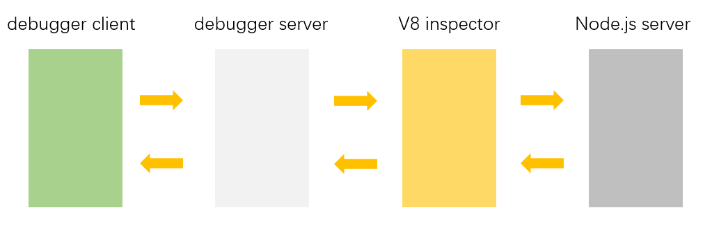

如图所示，进入 Node.js 调试模式前，主线程需要创建一个 debugger server（ websocket 服务，即时通讯服务，也即 node inspector ），用来实现 debugger client（例如 vscode 调试器或 Chrome DevTools ） 与 V8 inspector 通信，V8 inspector 再获取 Node.js 服务的数据，最终实现单步调试等功能。

经过封装与简化后，launch 模式启动调试时我们甚至感知不到 debugger server 了，但是它一定是存在的。

## 深入分析 -- inspect 参数

分析过程中，我对相关源码做了粗读，除了源码本身，还参考了这篇文章:<https://theanarkh.github.io/understand-nodejs/chapter24-Inspector/#11>

本文使用的 Node.js 源码是 18.20.2

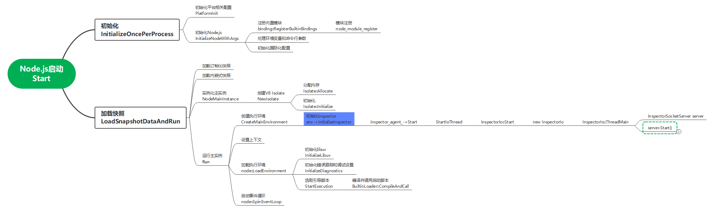

如上图所示，表示的是 Node.js 调试模式启动过程，大部分节点都是中文表述+函数名。

当我们用 node --inspect test.js 启动一个 js 脚本时，程序会启动 debugger server（一个 websocket 服务）。如上图所示，相关逻辑都在初始化 inspector 部分（蓝色节点），接下来细看一下这部分代码。

下图的起始节点 server.Start() 函数就是上图的末端节点 server.Start()。

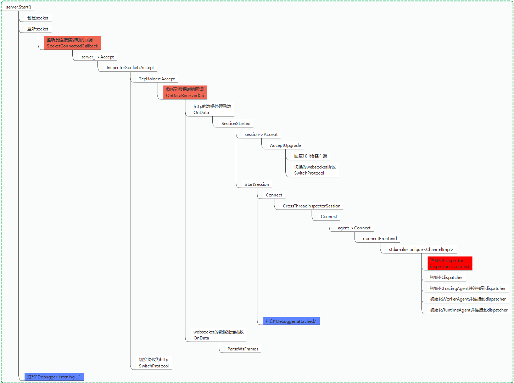

图中每一个节点都对应一个函数。无需理解所有节点，我们重点关注着色的几个节点。

**1.第一个蓝色节点**

当我们运行 node --inspect test.js 命令，可以看到如下打印，打印的内容 Node.js 开发者一定都很熟悉。

```js
Debugger listening on ws://127.0.0.1:9229/43b86c7c-e538-4d5c-98ba-3f5196d8e986
For help, see: https://nodejs.org/en/docs/inspector

// 这一行是Node开发者写的业务代码的打印
Server running at http://127.0.0.1:3000/
```

这个蓝色节点已经是启动代码执行的最后一步了，第一个橙色节点之后的部分在处理连接请求，也就是说，当代码走到第一个蓝色节点时，已经成功启动了一个 websocket 服务。

通过前面的代码还能看出，这个 websocket 服务在新起的子线程上运行，正因如此，调试程序才可以在主线程出现异常而崩溃的情况下，记录发送异常信息数据。

**2.第一个橙色节点**

注意这个节点代表一个回调函数，这个函数在服务启动时并没有执行。

它的执行是由 debugger client（例如 vscode 调试器或 Chrome DevTools ）发起的 http 请求触发的，这次是 client 发起的第一次请求。

这次请求，对 vscode 调试器来说，就是它的 attach 模式（ launch 模式是把启动和连接操作合并了）；对 Chrome DevTools 来说，感觉上应该是通过轮询连接的，这个点暂时就不再深入研究了。

**3.第二个橙色节点**

client 紧接着会发第二次请求（未确认），请求头会携带 upgrade websocket 信息。这时会触发第二个橙色节点处的回调函数，当识别到是升级请求时，debugger server 才真正升级为 websocket 服务。

**4.第二个蓝色节点**

升级完成后，控制台会打印“Debugger attached.”，这也是我们调试时常见的控制台打印信息。

接下来，debugger server 就可以正常处理业务请求了。

**5.特别关注一下红色节点**

这里的代码就可以看出，debugger client 与 debugger server 建立连接的过程中，debugger server 与 V8 inspector 建立了连接。

其实整个初始化 inspector（启动 debugger server ）的过程，是一套完整 websocket 实现，可以作为一个整体来看待。早期 Socket.io 模块是内置在 Node.js 中的。

### -- inspect-brk 参数

\--inspect-brk 命令，可以在用户代码启动前中断，相当于在用户代码的第一行打了个断点。

如下图所示，我们用 node --inspect-brk test.js 命令启动服务。可以看到，只有 debugger server 启动成功的提示，没有 node 服务启动成功的提示。这是因为在执行用户代码前停住了。

这个命令在我们想要研究或调试 node 代码启动，又不知道研究对象启动入口位置时，比较有用

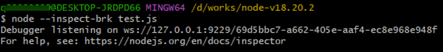

启动 debugger server 后，我们用连接上，这时可以看到执行停在了业务代码的第一行，而这一行我们并没有设置断点，如下图所示。

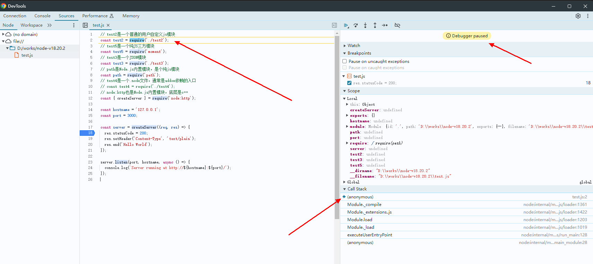

### -- inspect-wait 参数

这是 node 20 版本新增的启动参数，用于等待调试器连接后再执行代码。这样就可以从执行一开始就开始调试。

## Node.js 三种常见的调试方式

本节的介绍，没有像其他网络教程那样手把手，step by step 地写清楚操作步骤，是因为有讲调试原理。

初学者理解本节的前提是先看懂调试原理。

### 一、vscode 调试

vscode 调试是 Node.js 开发者最推荐的调试方式，因为可以一键启动调试模式，可以不用像 Chrome DevTools 调试那样起额外的窗口。

vscode 调试 Node.js 分为 launch 和 attach 两种模式，这里先介绍一下 launch 模式。

**launch 模式调试 Node.js**

1.创建一个 Node.js 服务，就是 test.js 文件，内容如下：

```js
const { createServer } = require('node:http')

const hostname = '127.0.0.1'
const port = 3000

const server = createServer((req, res) => {
  res.statusCode = 200
  res.setHeader('Content-Type', 'text/plain')
  res.end('Hello World')
})

server.listen(port, hostname, async () => {
  console.log(`Server running at http://${hostname}:${port}/`)
})
```

2.在 Node.js 服务入口文件所在的目录，点击 create a launch.json file 按钮，然后选择 Node.js 选项（这是选择调试器），vscode 会自动创建一个 launch.json 文件。

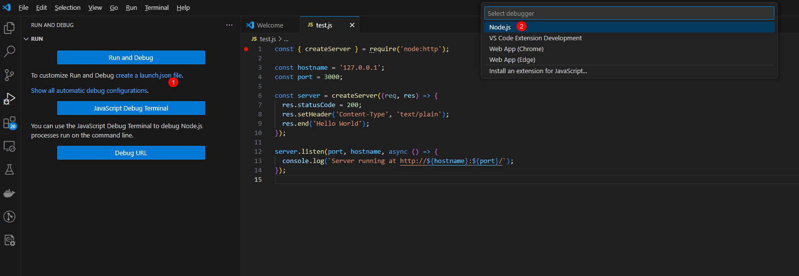

launch.json 文件内容如下，本场景就直接用自动生成的不需要作任何改动。

configurations 下的 request 字段表示的就是我们前面提到的调试模式，默认使用 launch 模式；name 表示这一套配置的名称，默认名称是 Launch Program，下一步会用到该名称；program 表示项目启动的入口文件。更多调试配置参考 vscode 官网

```js
{
  // Use IntelliSense to learn about possible attributes.
// Hover to view descriptions of existing attributes.
// For more information, visit: https://go.microsoft.com/fwlink/?linkid=830387
"version": "0.2.0",
"configurations": [
    {
      "type": "node",
      "request": "launch",
      "name": "Launch Program",
      "skipFiles": [
        // "<node_internals>/**"
      ],
      "program": "${workspaceFolder}\test.js"
    }
  ]
}
```

如果用如上文件，屏蔽 12 行，设置了不跳过内部代码，还可以调试到 Node.js 的 JS 源码。

3. 如下图所示，打断点，并选择 Launch Program，然后点击绿色三角，启动调试。

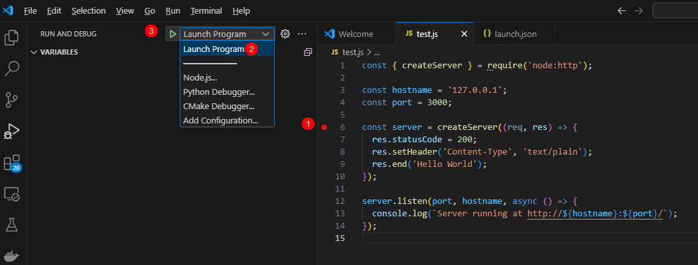

**attach 模式调试 Node.js**

顾名思义，这个模式不会触发 Node.js 和 debugger server 的启动，只会作为 debugger client 附加到已经启动的 Node.js 服务和 debugger server 上。如果能理解前面讲的调试原理，这里就很好理解了。

1.首先我们要运行 node --inspect test.js，这是在启动 debugger server。

同时启动的还有 node 服务，也就是图中的 <http://127.0.0.1:3000。>

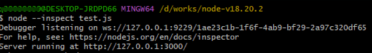

2.在 launch.json 文件中添加 attach 模式配置

port 字段表示要连接到的 debugger server 的端口号，也就是我们上一步的 9229。

address 字段表示 debugger server 的地址，也就是上一步的 ws\://127.0.0.1；debugger server 在本地的话，可以省略该配置。

```js
{
  // Use IntelliSense to learn about possible attributes.
// Hover to view descriptions of existing attributes.
// For more information, visit: https://go.microsoft.com/fwlink/?linkid=830387
"version": "0.2.0",
"configurations": [
    {
      "type": "node",
      "request": "launch",
      "name": "Launch Program",
      "skipFiles": [
        "<node_internals>/**"
      ],
        "program": "${workspaceFolder}\test.js"
      },
    {
      "type": "node",
      "request": "attach",
      "name": "Attach Program",
      "port": 9229,
      // "address": "localhost",
    },
  ]
}
```

3.上一步添加完 Attach Program 配置后，多了一个启动选项，如下图所示。选择 Attach Program，然后点击绿色三角按钮，启动调试，即可连接上第一步启动的 debugger server。

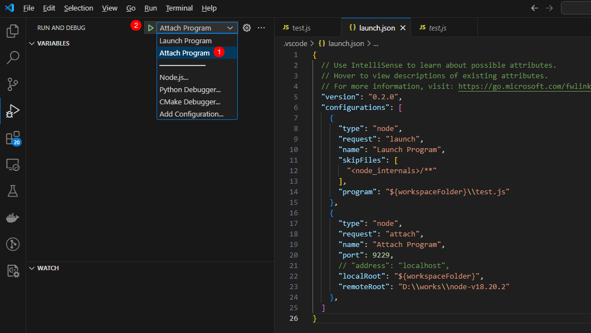

**远程调试**

attach 模式本地调试不常用，通常用于远程调试。目前 vscode 官方提供了两种远程调试方案：

- 使用远程开发扩展包（官方推荐）

这个方案不仅能远程调试，还能用于远程开发，比如我们有时可能需要在本地 Windows 机器上编辑远程的 Linux 服务器上的项目。但是要安装一系列插件，有些复杂

- attach 模式连接远程 debugger server

在前文的 attach 模式配置中，加一个 address 字段，填上远程 debugger server 的 IP 地址即可。

### 二、Chrome DevTools 调试

当我们理解了 Node.js 调试原理，Chrome DevTools 调试就变得手到擒来。

1.首先我们还是要运行 node --inspect test.js，这是在启动 debugger server。

同时启动的还有 node 服务，也就是图中的 <http://127.0.0.1:3000>


2.接下来再打开 chrome 控制台，就能看见 Node.js 的图标。注意没有启动 debugger server 的时候，图标是不会出现的。点击它，就可以打开 Chrome DevTools。

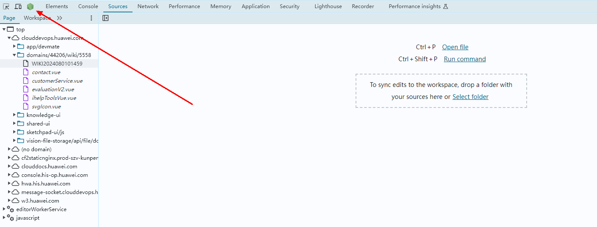

3.首次打开 DevTools 时，需要在 Connection tab 页配置准备连接的 debugger server。

可以看到 DevTools 自带了两个地址，如果是 debugger server 是在本地启动，并且使用的是默认的 9229 端口，就不需要添加连接地址了。

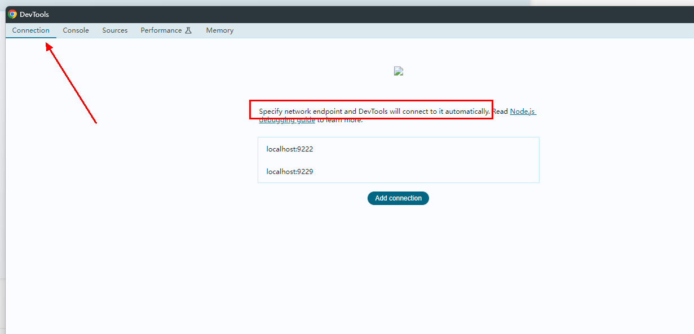

4.DevTools 连接 debugger server

之前有过介绍，vscode 连接 debugger server 需要用 attach 模式启动调试。

DevTools 这边在完成配置后，不需要任何操作就能自动连上 debugger server。（大概）是因为 DevTools 会轮询所配置的地址。

连接成功后，会触发 node 服务打印“Debugger attached.”提示语。

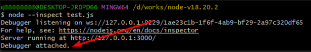

5.开始调试

我们切到 Sources tab 页，发现已经有了要调试的代码。在需要的位置打断点，再触发断点，即可调试。

例如下图中，断点位置的代码是请求处理代码，我们只需要访问一下 <http://127.0.0.1:3000> 这个地址，即可触发断点。

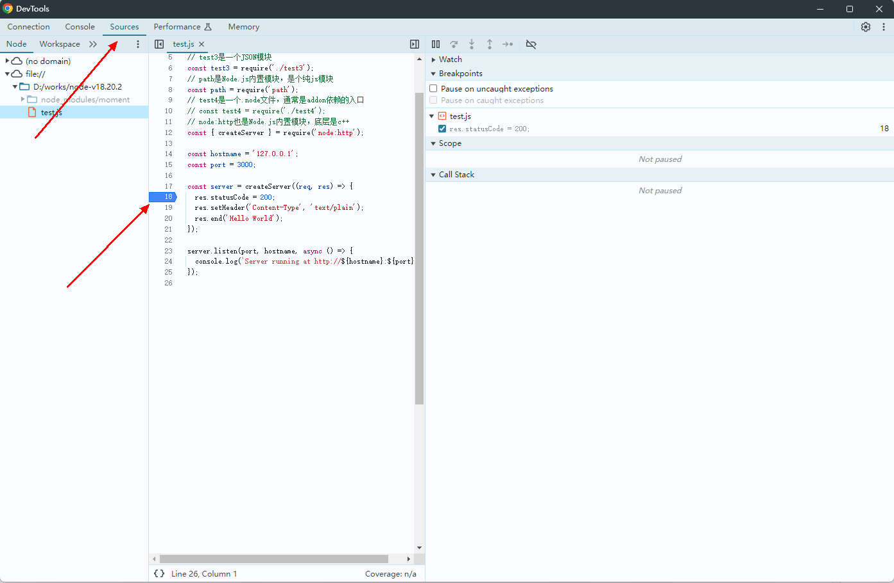

### 三、命令行调试

命令行调试是没有客户端之前的方式，现在一般不用，但是如果需要在不方便使用前面介绍的两种方式的情况下，例如需要在服务器本地调试，可以用命令行调试。

我们把命令的双横杠去掉，也就是运行 node inspect test.js 命令，结果如下图所示：

我们进入到了 Node.js 的命令行调试模式，具体的用法参考官方文档的 Debug 部分。

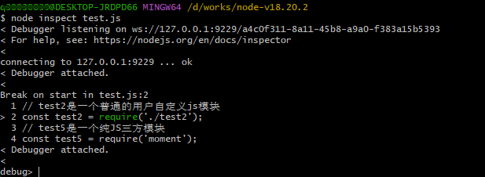

接下来贴一些常用命令用法：

#### **步进#**

- cont, c：继续执行
- next, n：下一步
- step，s： 进入方法内部
- out, o：退出当前方法
- pause：暂停正在运行的代码（类似开发者工具中的暂停按钮）

#### **断点#**

- setBreakpoint(), sb()：在当前行设置断点
- setBreakpoint(line), sb(line)：在特定行设置断点
- setBreakpoint('fn()'), sb(...)：在函数主体的第一个语句上设置断点
- setBreakpoint('script.js', 1), sb(...)：在第一行设置断点 script.js
- setBreakpoint('script.js', 1, 'num < 4'), sb(...)：在第一行设置条件断点 script.js，仅当 num < 4 计算结果为 true
- clearBreakpoint('script.js', 1), cb(...)：清除 script.js 第一行的断点

#### **信息#**

- backtrace, bt：打印当前调用栈

- list(5)：列出脚本源代码以及 5 行上下文（前后 5 行）

- watch(expr)：将表达式添加到观察列表，注意表达式需用引号括起来，如 watch("test2")

- unwatch(expr)：从观察列表中删除表达式

- unwatch(index)：从观察列表中删除特定索引处的表达式

- watchers：列出所有观察者及其值（每个断点上自动列出）

- repl：打开调试器的 repl，在调试脚本的上下文中查看数据或表达式

- exec expr, p expr：在调试脚本的上下文中执行表达式并打印其值

- profile：启动 CPU profiling session

- profileEnd：停止当前 CPU profiling session

- profiles：列出所有已完成的 CPU profiling session

- profiles\[n].save(filepath = 'node.cpuprofile')：将 CPU profiling session 以 JSON 格式保存到磁盘

- takeHeapSnapshot(filepath = 'node.heapsnapshot')：获取堆快照并以 JSON 格式保存到磁盘

注意一下，repl 命令可以进入断点所在上下文，方便地查看数据或表达式：

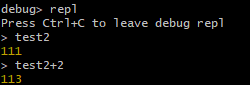

## inspector 模块的 API

Node.js 的 inspector 模块提供了一组 API，用于在运行时与 V8 引擎进行交互，调试和分析 Node.js 应用程序。

这些 API 使开发者可以通过编程方式启动调试会话、设置断点、执行调试命令、收集性能数据等。

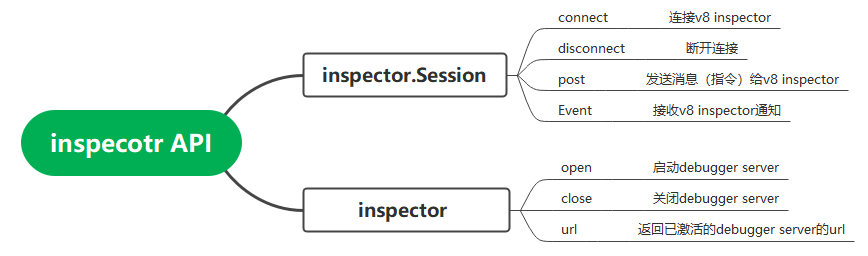
这里仅详细介绍两个方法：

1.inspector.Session 类的 post 方法可以向 v8 inspector 发送消息（指令），获取各种信息。v8 inspector 能识别的指令可以在 Chrome DevTools Protocol 中查看

贴一份官网的示例，对该类的能力可见一斑。

```js
import { Session } from 'node:inspector/promises'
import fs from 'node:fs'
const session = newSession()
session.connect()

await session.post('Profiler.enable')
await session.post('Profiler.start')
// Invoke business logic under measurement here...

// some time later...
const { profile } = await session.post('Profiler.stop')

// Write profile to disk, upload, etc.
fs.writeFileSync('./profile.cpuprofile', JSON.stringify(profile))
```

2.inspector.open 方法可以在节点启动后，以编程方式启动 debugger server。

vscode 有个通过进程 id，attach 到没有用--inspect 模式启动的 node 服务的能力，大概就是通过该接口实现的，暂未确认。

下一节，我们将讲解如何在 Node.js 中新增一个内置模块，请大家持续关注本系列内容\~学习完本系列，你将获得：

- 提升调试与性能优化能力
- 深入理解模块化与扩展机制
- 探索底层技术与定制化能力

## 关于 OpenTiny

欢迎加入 OpenTiny 开源社区。添加微信小助手：opentiny-official 一起参与交流前端技术～\
OpenTiny 官网：**<https://opentiny.design/>**\
OpenTiny 代码仓库：**<https://github.com/opentiny/>**\
TinyVue 源码：**<https://github.com/opentiny/tiny-vue>**\
TinyEngine 源码： **<https://github.com/opentiny/tiny-engine>**\
欢迎进入代码仓库 Star🌟TinyEngine、TinyVue、TinyNG、TinyCLI\~ 如果你也想要共建，可以进入代码仓库，找到 good first issue 标签，一起参与开源贡献\~
