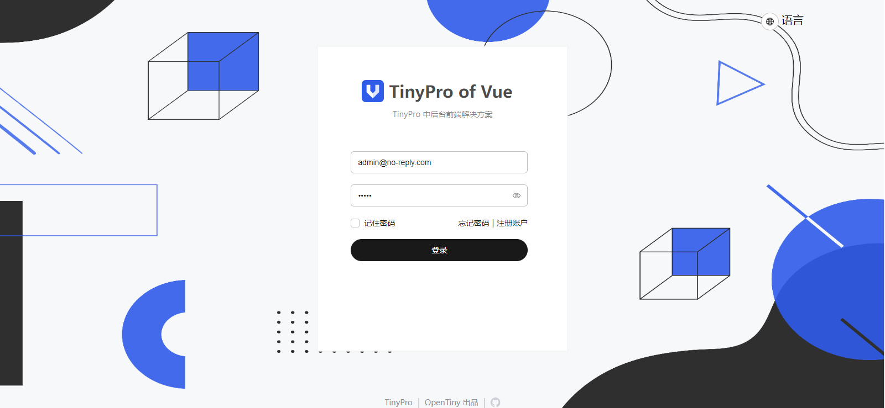

# 快速上手

---

## 环境准备

请确保您安装了`nodejs`, `npm`, `tiny-cli`

```bash
tiny init pro
```

运行上述代码后按照提示输入配置

```
? 请输入项目名称： tiny-pro
? 请输入项目描述： 基于TinyPro套件创建的中后台系统
* 请选择您希望使用的客户端技术栈： vue
* 请选择您希望使用的服务端技术栈： Nest.js
* 请选择你想要的构建工具:  Vite
* 请确保已安装数据库服务（参考文档
https://www.opentiny.design/tiny-cli/docs/toolkits/pro#database）：
已完成数据库服务安装，开始配置
* 请选择数据库类型： MySql
* 请输入数据库地址： localhost
* 请输入数据库端口： 3306
* 请输入数据库名称： ospp-nest
* 请输入登录用户名： root
* 请输入密码： [hidden]
```

初始化完成后，项目结构应该为

```
tiny-pro
  nestJs    # 后端服务
  web       # 前端服务
```

## 后端启动

后端服务支持`docker启动`与`命令启动`， 执行操作前请先确保所处位置为`tiny-pro/nestJS`

### Docker启动

> 如果是 Windows 用户, 请您确保 `Docker Desktop` 已经启动

在运行`docker compose up -d`之前，请先修改`.env`环境变量文件，示例如下

```properties
#  数据库IP
DATABASE_HOST = 'localhost'
#  数据库端口
DATABASE_PORT = 3306
#  数据库用户
DATABASE_USERNAME = 'root'
#  数据库密码
DATABASE_PASSWORD = 'root'
#  数据库名称 (确保数据库存在)
DATABASE_NAME = 'demo_tiny_pro'
#  是否强制同步数据库 (线上建议关闭)
DATABASE_SYNCHRONIZE = true
#  是否自动加载Entry (建议设置为true)
DATABASE_AUTOLOADENTITIES = true
#  jwt盐
AUTH_SECRET = 'secret'
#  AccessToken默认过期时间
REDIS_SECONDS = 7200
#  Redis IP
REDIS_HOST = 'localhost'
#  Redis 端口
REDIS_PORT = 6379
#  JwT过期时间 (已废弃)
EXPIRES_IN = '2h'
#  分页默认起始页码数
PAGINATION_PAGE = 1
#  分页默认起始大小
PAGINATION_LIMIT = 10
#  api接口全局前缀
GLOBAL_PREFIX = '/'
#  mock接口glob表达式
MOCK_REGEX = '/mock'
#  refreshToken过期时间
REFRESH_TOKEN_TTL = 604800000
#  最大会话数, -1表示不限制
DEVICE_LIMIT=1
#  是否启用演示模式, 如果设置为true, 则会拒绝所有的增加、修改、删除操作
PREVIEW_MODE=true
#  Swagger文档标题
SWAGGER_TITLE="Tiny Pro"
#  Swagger文档简介
SWAGGER_DESC="开箱即用的中后台模板"
#  Swagger文档版本
SWAGGER_VERSION="1.0.0"

```

修改完`.env`文件后，请执行`docker compose up -d`


当执行`docker ps`中`STATUS`列均为`Up`时，表示后端启动成功

```
CONTAINER ID   IMAGE         COMMAND                  CREATED          STATUS          PORTS                               NAMES
b76f3ebebe81   nestjs-back   "docker-entrypoint.s…"   12 minutes ago   Up 11 minutes   0.0.0.0:3000->3000/tcp              nestjs-back-1
32ae9982b96a   redis         "docker-entrypoint.s…"   12 minutes ago   Up 12 minutes   0.0.0.0:6379->6379/tcp              nestjs-redis-1
94f3b55b7b2b   mysql:8       "docker-entrypoint.s…"   12 minutes ago   Up 12 minutes   0.0.0.0:3306->3306/tcp, 33060/tcp   nestjs-mysql-1
```

### 命令启动

#### 依赖安装

```bash
npm i
```

#### 环境准备

#### 安装MySQL

请参考[MySQL 8.0安装](https://dev.mysql.com/doc/mysql-installation-excerpt/8.0/en/windows-installation.html)

#### 安装Redis服务

请参考[Redis 官方手册](https://redis.io/docs/latest/operate/oss_and_stack/install/install-redis/install-redis-on-windows/)

请确保您的机器已经安装了`Mysql`与`Redis`服务。接下来，我们需要配置`.env`环境变量文件。`.env`文件示例如下

```properties
#  数据库IP
DATABASE_HOST = 'localhost'
#  数据库端口
DATABASE_PORT = 3306
#  数据库用户
DATABASE_USERNAME = 'root'
#  数据库密码
DATABASE_PASSWORD = 'root'
#  数据库名称 (确保数据库存在)
DATABASE_NAME = 'demo_tiny_pro'
#  是否强制同步数据库 (线上建议关闭)
DATABASE_SYNCHRONIZE = true
#  是否自动加载Entry (建议设置为true)
DATABASE_AUTOLOADENTITIES = true
#  jwt盐
AUTH_SECRET = 'secret'
#  AccessToken默认过期时间
REDIS_SECONDS = 7200
#  Redis IP
REDIS_HOST = 'localhost'
#  Redis 端口
REDIS_PORT = 6379
#  JwT过期时间 (已废弃)
EXPIRES_IN = '2h'
#  分页默认起始页码数
PAGINATION_PAGE = 1
#  分页默认起始大小
PAGINATION_LIMIT = 10
#  api接口全局前缀
GLOBAL_PREFIX = '/'
#  mock接口glob表达式
MOCK_REGEX = '/mock'
#  refreshToken过期时间
REFRESH_TOKEN_TTL = 604800000
#  最大会话数, -1表示不限制
DEVICE_LIMIT=1
#  是否启用演示模式, 如果设置为true, 则会拒绝所有的增加、修改、删除操作
PREVIEW_MODE=true
#  Swagger文档标题
SWAGGER_TITLE="Tiny Pro"
#  Swagger文档简介
SWAGGER_DESC="开箱即用的中后台模板"
#  Swagger文档版本
SWAGGER_VERSION="1.0.0"
```

#### 启动项目

在启动项目前请您做好如下检查

- [ ] MySQL服务可以正常访问
- [ ] Redis服务可以正常访问
- [ ] MySQL中存在`.env`文件中`DATABASE_NAME`字段定义的数据库，且该数据库为空
- [ ] 您已经运行了 `node migrate.js` 命令且出现了 `Now you can safely launched the project` 字样。
- [ ] `.env`文件中`DATABASE_SYNCHRONIZE`为`false`
- [ ] `tiny-pro`后端依赖已经安装

完成上述检查后，您可以在`tiny-pro/nestJs`下执行`npm run start`.

```
LOG [NestApplication] Nest application successfully started +11ms
Application is running on: http://[::1]:3000
```

当出现上述文本时候即为后端启动成功。

## 前端启动

### 依赖安装

```bash
cd tiny-pro/web
npm i
```

### 项目启动

在项目启动前，请您确保后端服务已经启动成功，且可以正常访问。我们列出了一个启动前检查清单，您可以对照检查清单来进行启动前检查

- [ ] 后端服务启动成功
- [ ] 前端依赖安装完成
- [ ] `npm run mock`启动mock服务

上述列表全部检查完成后，运行 `npm run start` 即可启动前端服务，浏览器会自行打开项目，当出现下图时则代表启动成功。



## 前端打包

对于前端项目打包，只需要执行`npm run build`即可

## 后端打包

### 命令打包

运行`npm run build`即可

### docker打包

> 这里只阐述默认 tiny-pro 后端打包，如果您进行了修改(例如增加了某些node-gyp依赖，请修改`dockerfile`手动安装`node-gyp`系统级前置依赖)

运行 `docker build -t tinypro:latest` 即可

## 遇到困难?

加官方小助手微信 opentiny-official，加入技术交流群

## 迁移

### 从 1.x 迁移

从 2.0 开始, TinyPro For Nest.js 使用Redis存储安装Flag文件, 如果您使用过 1.0 版本请按照以下检查单进行迁移

- [ ] Redis 服务可用
- [ ] 切换到TinyPro部署的数据库并执行 `flushdb` 或手动清空
- [ ] 执行 `SET FLAG:INSTALL 1`


## 常见问题

### 后端docker启动时出现 `Error response from daemon: Ports are not available: exposing port TCP 0.0.0.0:3306 -> 0.0.0.0:0: listen tcp 0.0.0.0:3306: bind: Only one usage of each socket address (protocol/network address/port) is normally permitted.`

这是因为宿主机的某些应用占用了`3306`端口, 请先释放宿主机该端口后手动启动MySQL服务

### 后端使用`docker compose up -d`启动时候，出现I/O timeout错误

这主要是因为网络问题，您可以手动执行下述命令

```
docker pull node:alpine
docker pull node:lts
```

输入完上述命令后再次执行`docker compose up -d`即可。


### 提示 `Lock file exists, if you want init agin, please remove dist or dist/lock`

- 对于 `1.x` 用户来说可以直接删除 `dist/lock` 文件夹.
- 对于 `2.x` 用户来说可以在redis中执行 `DEL FLAG:INSTALL`

### docker 部署时数据库超时

在新版本中我们加入了 `wait4x` 来检查 `mysql` 容器情况。但这并不能完全避免因为 `mysql` 启动过慢而导致的容器启动失败。在业务容器中我们设定的轮询时间为2s, 最多等待60s. 如果超时请按照如下检查表逐一排查

1. MySQL容器是否启动成功?
2. MySQL容器是否初始化成功?
3. 业务容器环境变量是否正确?


### 前端跨域问题如何解决

对于开发环境来说，可以直接修改`dev-server`的`proxy`. 例如`vite`工具的`server.proxy`

### 代码无法提交

您可以选择移除husky或根据[Angular 规范](https://zj-git-guide.readthedocs.io/zh-cn/latest/message/Angular%E6%8F%90%E4%BA%A4%E4%BF%A1%E6%81%AF%E8%A7%84%E8%8C%83/)书写commit信息

### 页面部署后刷新404

请移步[Vue Router服务器部署指南](https://router.vuejs.org/guide/essentials/history-mode.html#Example-Server-Configurations)
